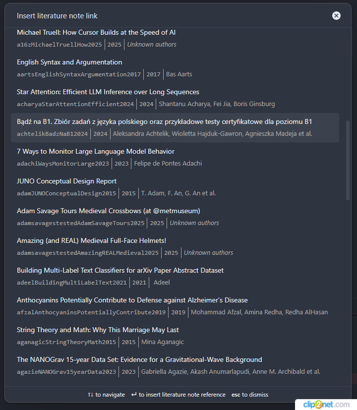

# Obsidian Citation Extended

This plugin for [Obsidian](https://obsidian.md) integrates your academic reference manager with the Obsidian editing experience.



The plugin supports reading bibliographies in [BibTeX / BibLaTeX `.bib` format][4], [CSL-JSON format][1], [Hayagriva YAML][5], and directly from the [Readwise](https://readwise.io) API.

## Quick Start

1. Install from Obsidian's Community Plugins browser
2. Export your bibliography from [Zotero + Better BibTeX][2], Mendeley, or Paperpile
3. Add the database in plugin settings
4. Use `Ctrl+Shift+O` to search and open literature notes

For detailed setup instructions, see [Getting Started](docs/getting-started.md).

## Features

- **Open literature note** — create or open a note for any reference
- **Insert literature note link** — insert a wiki-link or markdown link
- **Insert literature note content** — insert rendered template content at cursor
- **Insert markdown citation** — insert [Pandoc-style citations][3] with presets (textcite, parencite)
- **Readwise integration** — import highlights and documents from Readwise as citable entries
- **Refresh citation database** — manually reload all sources

See [Features](docs/features.md) for details.

## Templates

Customize your notes using [Handlebars](https://handlebarsjs.com/) templates with 25+ variables, 18+ helpers, and built-in citation style presets.

- [Template Variables](docs/templates/variables.md) — all available variables
- [Template Helpers](docs/templates/helpers.md) — comparison, string, date, author helpers
- [Template Examples](docs/templates/examples.md) — recipes for YAML frontmatter, Zettelkasten, conditional content

## Multiple Databases

Load citations from multiple `.bib`, `.json`, or `.yml` files and the Readwise API. Duplicate citekeys are preserved with database prefixes.


See [Data Sources](docs/data-sources.md) and [Configuration](docs/configuration.md) for details.

## Documentation

Full documentation is in the [docs/](docs/index.md) directory.

## Development

```bash
npm run dev      # Watch mode
npm run build    # Production build
npm run lint     # ESLint
npm test         # Jest test suite
```

See [Development Guide](docs/development.md) for architecture and contribution info.

## License

MIT License.

## Support

If you find this plugin useful, consider [buying me a coffee](https://coff.ee/akhmelevskiy).

[1]: https://github.com/citation-style-language/schema#csl-json-schema
[2]: https://retorque.re/zotero-better-bibtex/
[3]: https://pandoc.org/MANUAL.html#extension-citations
[4]: http://www.bibtex.org/
[5]: https://github.com/typst/hayagriva
