# Architecture — Obsidian Citation Extended

## Table of Contents

- [System Overview](#system-overview)
- [Layer Map](#layer-map)
- [Plugin Lifecycle](#plugin-lifecycle)
- [Platform Layer](#platform-layer)
- [Library Loading Flow](#library-loading-flow)
- [Source Lifecycle](#source-lifecycle)
- [Normalization Pipeline](#normalization-pipeline)
- [Multiple Databases](#multiple-databases)
- [Search](#search)
- [Action System](#action-system)
- [Template System](#template-system)
- [Note Service](#note-service)
- [Batch Update](#batch-update)
- [Readwise Integration](#readwise-integration)
- [Annotation Model](#annotation-model)
- [Settings & Configuration](#settings--configuration)
- [Worker Protocol](#worker-protocol)
- [Core Types](#core-types)
- [Error Handling](#error-handling)
- [Service Contracts](#service-contracts)
- [Obsidian API Boundary](#obsidian-api-boundary)

---

## System Overview

The plugin loads bibliographic data from multiple sources (BibTeX, CSL-JSON, Hayagriva, Readwise), normalizes them through a composable pipeline, indexes for full-text search, and provides commands for citation insertion and literature note management in Obsidian.

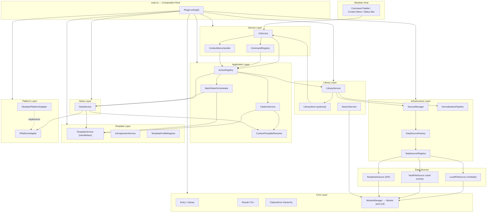

The system follows Clean Architecture: business logic (`application/`, `domain/`, `core/`) has zero imports from `obsidian`. Only `platform/`, `sources/`, `services/`, and `ui/` touch Obsidian APIs.

---

## Layer Map

| Layer              | Directory             | Depends on Obsidian? | Responsibility                                                    |
| ------------------ | --------------------- | -------------------- | ----------------------------------------------------------------- |
| **Core**           | `src/core/`           | No                   | Entry types, parsers, Result, errors, adapters                    |
| **Domain**         | `src/domain/`         | No                   | TemplateProfile, NoteKind, TemplateProfileRegistry                |
| **Application**    | `src/application/`    | No                   | CitationService, ActionRegistry, Actions, ContentTemplateResolver |
| **Library**        | `src/library/`        | No                   | LibraryService, LibraryStore, SearchService                       |
| **Template**       | `src/template/`       | No                   | TemplateService, Handlebars helpers, IntrospectionService         |
| **Notes**          | `src/notes/`          | No                   | NoteService, BatchNoteOrchestrator                                |
| **Infrastructure** | `src/infrastructure/` | No                   | SourceManager, NormalizationPipeline                              |
| **Search**         | `src/search/`         | No                   | MiniSearch wrapper                                                |
| **Platform**       | `src/platform/`       | **Yes**              | IPlatformAdapter interfaces + ObsidianPlatformAdapter             |
| **Sources**        | `src/sources/`        | **Yes**              | LocalFileSource, VaultFileSource, DataSourceRegistry              |
| **Services**       | `src/services/`       | **Yes**              | CommandRegistry, ContextMenuHandler                               |
| **UI**             | `src/ui/`             | **Yes**              | Modals, SettingsTab, UIService                                    |
| **Entry point**    | `src/main.ts`         | **Yes**              | Composition root, settings migration, DI wiring                   |

---

## Plugin Lifecycle

DI is functional — no IoC container. Every service receives dependencies through the constructor. `main.ts` is the single composition root.

```mermaid
flowchart TD
    subgraph Load["onload()"]
        LS1["1. loadSettings()"] --> LS2["2. WorkerManager"]
        LS2 --> LS3["3. PlatformAdapter"]
        LS3 --> LS4["4. DataSourceRegistry\n   register: LocalFile, VaultFile"]
        LS4 --> LS5["5. DataSourceFactory"]
        LS5 --> LS6["6. SourceManager"]
        LS6 --> LS7["7. NormalizationPipeline\n   steps: SourceTagging → Dedup"]
        LS7 --> LS8["8. TemplateProfileRegistry"]
        LS8 --> LS9["9. ContentTemplateResolver"]
        LS9 --> LS10["10. TemplateService"]
        LS10 --> LS11["11. NoteService"]
        LS11 --> LS12["12. LibraryService"]
        LS12 --> LS13["13. CitationService"]
        LS13 --> LS14["14. BatchNoteOrchestrator"]
        LS14 --> LS15["15. UIService"]
        LS15 --> LS16["16. Template migrations"]
        LS16 --> LS17["17. init()\n    libraryService.load()\n    uiService.init()"]
    end

    subgraph Settings["loadSettings()"]
        S1["Load persisted data"] --> S2["Merge with DEFAULT_SETTINGS"]
        S2 --> S3["Zod validate"]
        S3 --> S4{"Migrations?"}
        S4 -->|Legacy single DB| S5["Push to databases[]"]
        S4 -->|Missing db.id| S6["generateDatabaseId()"]
        S4 -->|None| S7["Done"]
        S5 --> S7
        S6 --> S7
    end

    subgraph Unload["onunload()"]
        U1["uiService.dispose()"] --> U2["libraryService.dispose()"]
        U2 --> U3["sourceManager.dispose()"]
        U3 --> U4["workerManager.dispose()"]
    end
```

### Settings Migration

On first load after upgrade, `main.ts` handles three migration scenarios:

1. **Legacy single-database** — if `databases[]` is empty but `citationExportPath` exists, the old config is pushed into `databases[]` with a generated `id`.
2. **Missing database IDs** — databases without `id` get one via `generateDatabaseId()` (format: `db-{timestamp}-{random4}`).
3. **Inline template → file** — if `literatureNoteContentTemplate` contains content but no file path is set, the content migrates to a vault file and the inline field is cleared.

---

## Platform Layer

`src/platform/` isolates all Obsidian API behind interfaces. Every other layer depends on `IPlatformAdapter`, never on `App` or `Plugin` directly.

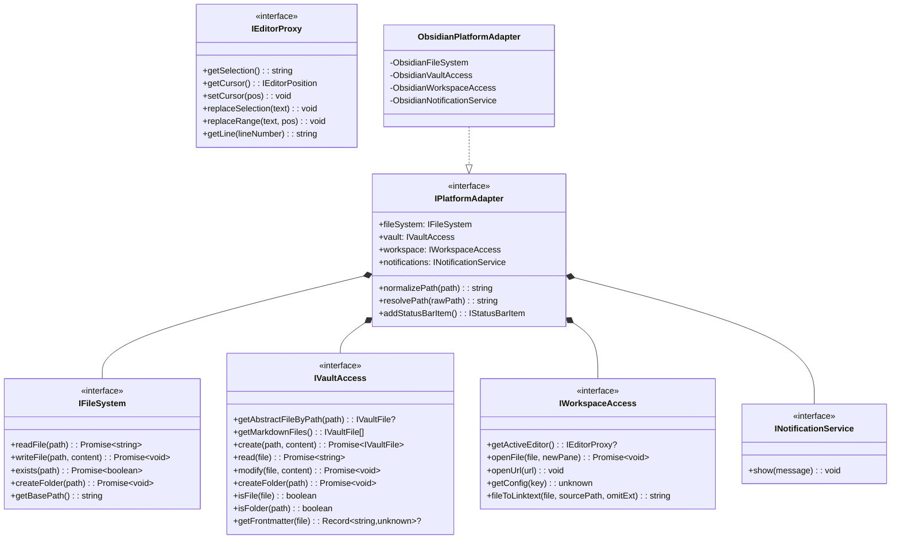

`ObsidianPlatformAdapter` delegates to internal sub-adapters:

| Sub-adapter                   | Wraps                        | Notes                                                                                                                                                                                 |
| ----------------------------- | ---------------------------- | ------------------------------------------------------------------------------------------------------------------------------------------------------------------------------------- |
| `ObsidianFileSystem`          | `FileSystemAdapter`, `Vault` | UTF-8 read/write, folder creation with "already exists" guard                                                                                                                         |
| `ObsidianVaultAccess`         | `App.vault`                  | Maps `TFile`/`TFolder` → `IVaultFile`                                                                                                                                                 |
| `ObsidianWorkspaceAccess`     | `App.workspace`              | **Canvas fallback**: tries `MarkdownView`, then `activeEditor?.editor` for Canvas/Lineage editors. **URL opening**: Electron `shell.openExternal` on desktop, `window.open` on mobile |
| `ObsidianNotificationService` | `Notice`                     | Transient toast messages                                                                                                                                                              |

All services are testable without Obsidian via `createMockPlatformAdapter()` in `tests/helpers/`.

---

## Library Loading Flow

Loading is the most complex data flow. It involves LibraryService, SourceManager, Worker, NormalizationPipeline, and SearchService.

```mermaid
sequenceDiagram
    participant UI as UIService
    participant LS as LibraryService
    participant Store as LibraryStore
    participant SM as SourceManager
    participant Src as DataSource[]
    participant WM as WorkerManager
    participant W as Web Worker
    participant NP as NormalizationPipeline
    participant SS as SearchService

    UI->>LS: load()
    LS->>LS: abort previous (AbortController)
    LS->>Store: setState(Loading)
    Store-->>UI: notify subscribers

    LS->>SM: syncSources(databases)
    Note over SM: Create/update/dispose sources<br/>based on config diff

    LS->>SM: loadAll()
    par Parallel loading (worker pool)
        SM->>Src: source1.load()
        Src->>WM: post({ kind: 'parse', databaseRaw, databaseType }, signal, [buffer])
        WM->>W: worker A parses bibliography
        W-->>WM: { entries, parseErrors }
        WM-->>Src: DataSourceLoadResult
        Src-->>SM: SourceLoadResult
    and
        SM->>Src: source2.load()
        Src->>WM: post(...)
        WM->>W: worker B parses bibliography (concurrently)
        W-->>WM: { entries, parseErrors }
        WM-->>Src: DataSourceLoadResult
        Src-->>SM: SourceLoadResult
    end

    Note over SM: Each source's result is cached<br/>for later incremental reloads

    SM-->>LS: SourceLoadResult[]

    LS->>NP: pipeline.run(results)
    Note over NP: 1. SourceTaggingStep<br/>2. DeduplicationStep<br/>→ merged Library
    NP-->>LS: Library

    LS->>SS: await buildIndex(entries)
    Note over SS: Index built in worker (or async<br/>chunked fallback), swapped in atomically;<br/>searches keep using the old index meanwhile

    LS->>Store: setState(Success)
    Store-->>UI: notify → update status bar

    LS->>SM: initWatchers((sourceKey) => debounced reload)
    Note over SM: chokidar / vault events / Readwise poll<br/>→ debounced INCREMENTAL reload
```

### Incremental Reload

A watcher event does **not** trigger a full reload. The watcher callback
carries the stable source key, and `LibraryService` collects pending keys
during the debounce window, then calls `SourceManager.reloadSources(keys)`:

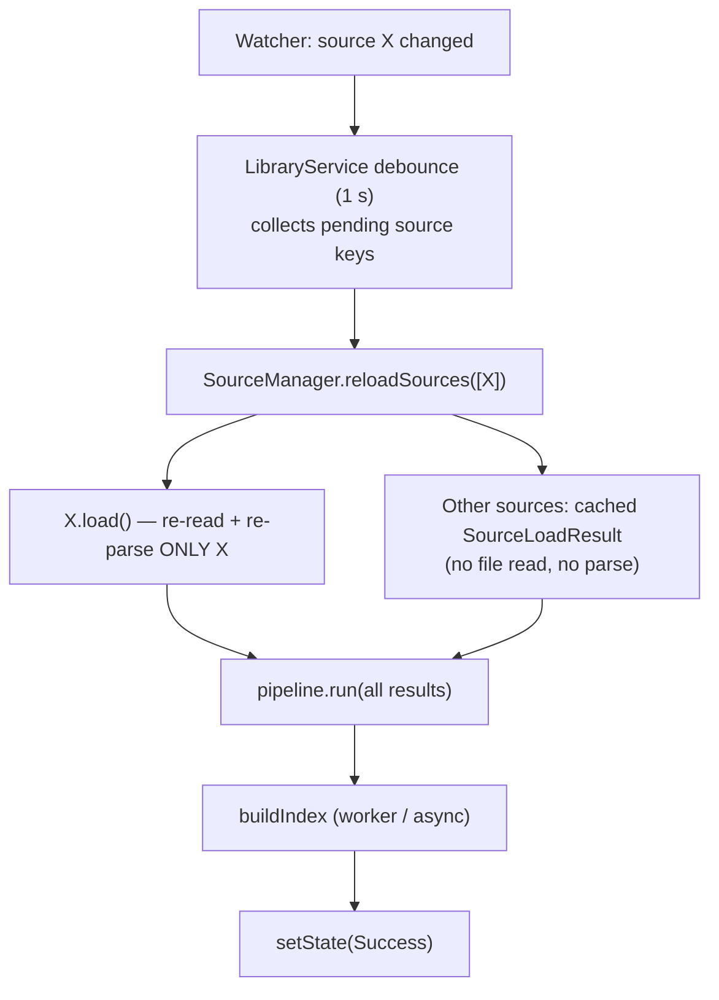

The cost of reacting to a change is proportional to the size of the changed
database, not the whole library. A full `load()` still runs on startup,
manual refresh, retry recovery, and settings changes.

### Protection Mechanisms

| Mechanism                  | Value                                                       | Purpose                                                                                                                                              |
| -------------------------- | ----------------------------------------------------------- | ---------------------------------------------------------------------------------------------------------------------------------------------------- |
| **Timeout**                | configurable via `libraryLoadTimeoutSeconds` (default 30 s) | Race (`Promise.race`) against the source loading promise; the load signal is threaded to sources so the in-flight work is cancelled on timeout       |
| **AbortController**        | per load                                                    | Cancel in-flight load on new `load()` call; aborting a worker task **terminates** its worker, so an abandoned parse stops immediately                |
| **Debounce**               | 1 000 ms                                                    | Coalesce rapid file change events from watchers (pending source keys are collected during the window)                                                |
| **Retry**                  | 5 attempts                                                  | Exponential backoff: 1 s → 2 s → 4 s → 8 s → 16 s (capped at 30 s); retries are always full loads                                                    |
| **Worker pool**            | up to 3 workers                                             | Parallel parsing across databases; a wedged or aborted worker is terminated and replaced                                                             |
| **Stale-while-revalidate** | search modal + index                                        | During a reload the modal keeps searching the previous library, and `SearchService` keeps serving the previous index until the new one is swapped in |

### State Machine

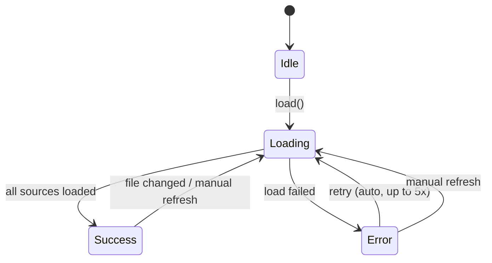

`LibraryStore` uses a pub/sub pattern: `subscribe(fn)` returns an unsubscribe function. Subscribers are called immediately with current state on subscription (eager init) and on every `setState()`.

---

## Source Lifecycle

`SourceManager` manages `DataSource` instances keyed by a stable identity string.

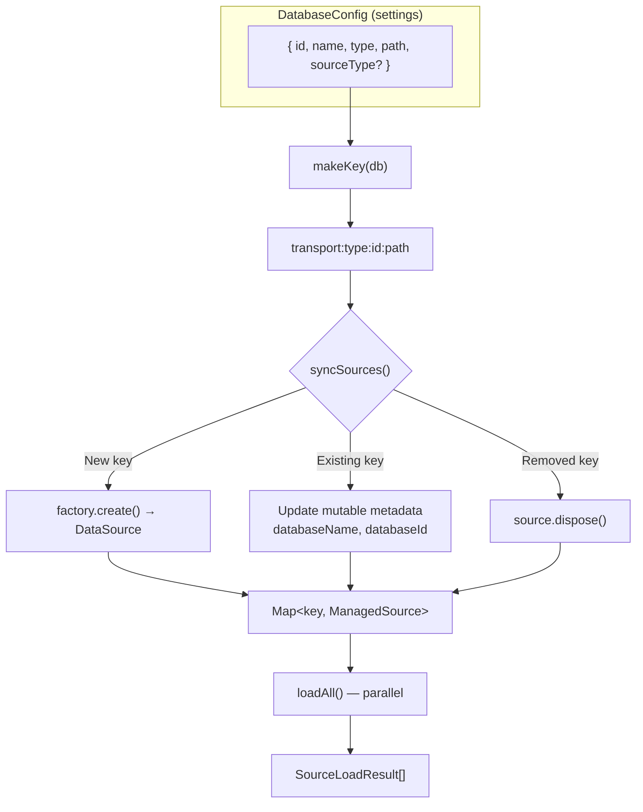

### ManagedSource

```typescript
interface ManagedSource {
  source: DataSource;            // The actual data source instance
  databaseId: string;            // Stable internal identifier (from db.id)
  databaseName: string;          // User-facing display name (mutable, updated on sync)
  lastResult?: SourceLoadResult; // Cached last load result for incremental reloads
  lastFailed?: boolean;          // Whether lastResult is a synthetic failure
}
```

`lastResult` is the foundation of incremental reloading: `reloadSources(keys)`
re-loads only the named sources (plus any source that has never loaded) and
returns cached results for the rest. An aborted load is never cached as a
failure.

### Key Stability

The identity key is `${transport}:${type}:${id}:${path}` for file-based
sources and `${transport}:${type}:${id}:fp-${fingerprint}` for API-based
sources, where the fingerprint folds the credential (`db.path` holds the
Readwise token) and the per-database filters — so secrets never leak into
keys or debug logs. This means:

- **Renaming** a database (changing `name`) does **not** recreate the source — the key stays the same, only `databaseName` metadata is refreshed.
- **Changing format** (e.g., `biblatex` → `csl-json`) **does** recreate the source — the key changes because `type` changed.
- **Changing path** recreates the source (for Readwise, the path is the token, so a token change recreates the source via the fingerprint).
- **Changing Readwise filters** recreates the source (the factory snapshots filters at creation time).
- **An unchanged Readwise config preserves the source** across reloads, keeping its polling timer and incremental-sync continuity alive (previously it was force-recreated on every sync).
- **Without `id`** (pre-migration databases), `name` is used as fallback with a console warning.

### DataSource Registration (Open/Closed)

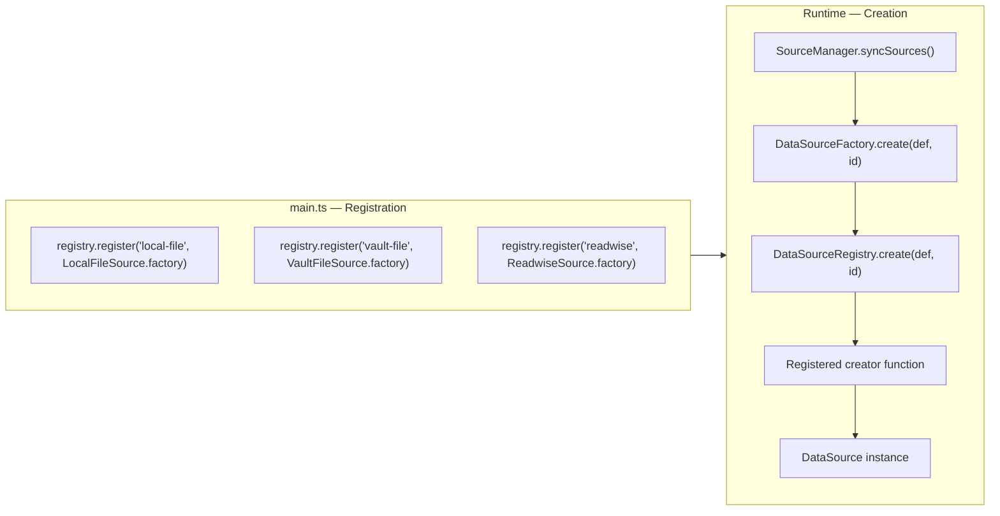

New source types are registered as creators in `main.ts` — no changes to SourceManager or Factory needed. The Readwise source demonstrates this: it was added without modifying any existing infrastructure code.

### Watch Mechanisms

| Source            | Watcher                                            | Events                     | Debounce                      |
| ----------------- | -------------------------------------------------- | -------------------------- | ----------------------------- |
| `LocalFileSource` | chokidar                                           | `change`, `add`            | 1 000 ms (per-source)         |
| `VaultFileSource` | Vault events                                       | `modify`, `create`         | 1 000 ms (per-source)         |
| `ReadwiseSource`  | Chained `setTimeout` (interval re-read each cycle) | Configurable periodic sync | Default 30 min (0 = disabled) |

Both `watch()` methods are **silently idempotent** — calling `watch()` on an already-watching source is a no-op without warnings.

---

## Normalization Pipeline

The pipeline transforms raw entries from multiple sources into a unified, deduplicated `Library`.

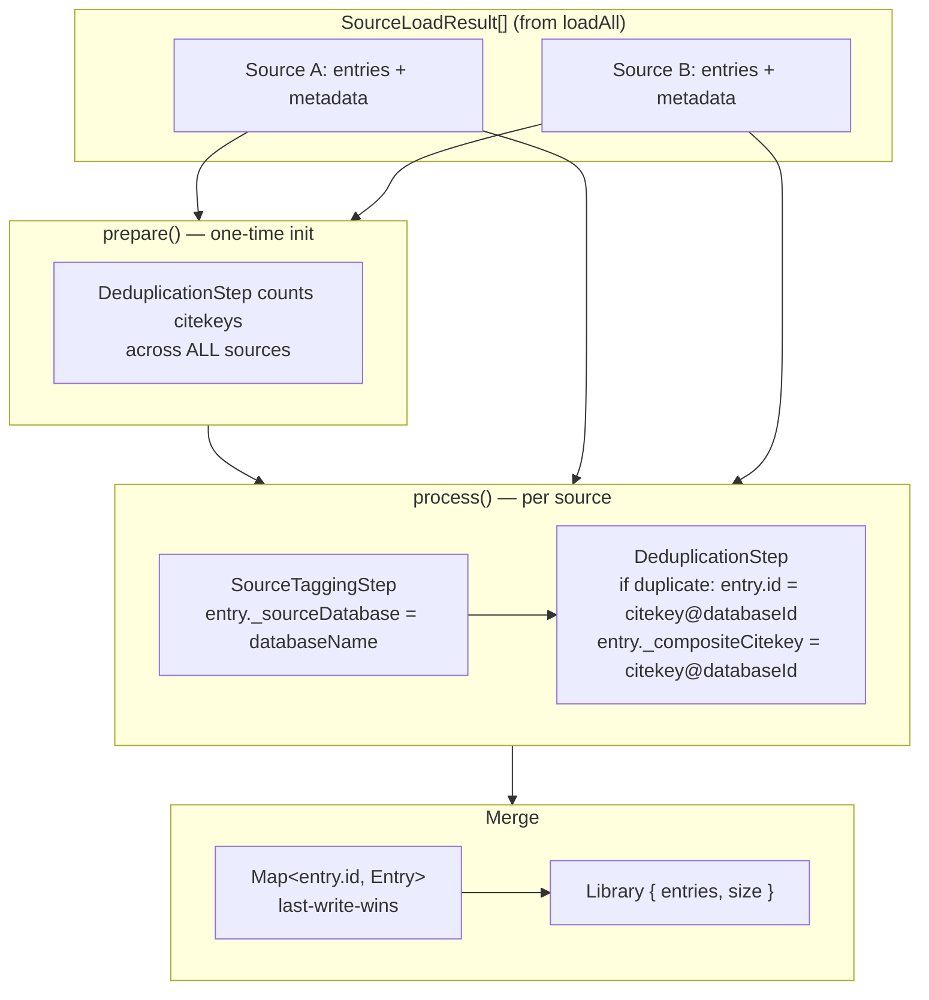

### Step Interface

```typescript
interface NormalizationStep {
  readonly name: string;
  prepare?(results: SourceLoadResult[]): void;  // Optional global pre-processing
  process(entries: Entry[], metadata: SourceMetadata): Entry[];  // Per-source transform
}
```

### SourceTaggingStep

Tags every entry with the user-facing database name for display in search modals and metadata.

```
entry._sourceDatabase = metadata.databaseName   // e.g., "Zotero"
```

### DeduplicationStep

Handles citekey collisions across databases. Uses **stable `databaseId`** (not display name) so renames don't break composite keys.

```
prepare():
  Count citekey occurrences across all sources
  "smith2020" → 2 (in Zotero + Mendeley)
  "jones2021" → 1 (only in Zotero)

process():
  "smith2020" (count > 1) → "smith2020@db-1700000-a1b2"
  "jones2021" (count = 1) → "jones2021" (unchanged)
```

Both steps create new objects (`Object.create()` + `Object.assign()`) — they never mutate input entries.

---

## Multiple Databases

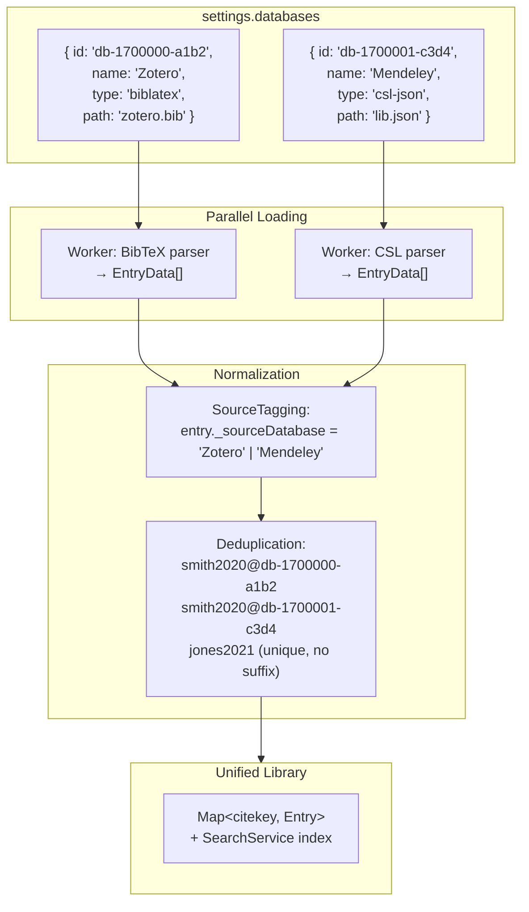

### DatabaseConfig.id — Stable Identity

Each `DatabaseConfig` has a field `id: string` (format `db-{timestamp}-{random4}`), generated once via `generateDatabaseId()`. The `id` is an internal stable identifier — never shown in UI, never changes. The `name` is a user-facing label that can be freely renamed.

This separation provides:

- **Stable composite citekeys** — `DeduplicationStep` uses `databaseId`, so renaming a database doesn't break `citekey@databaseId` references.
- **Stable source identity** — `SourceManager.makeKey()` includes `db.id`, so renaming doesn't recreate sources (preserving watcher state).
- **Safe metadata refresh** — `syncSources()` updates `databaseName` and `databaseId` on existing sources without disposing them.

---

## Search

`SearchService` wraps MiniSearch for full-text bibliographic search.

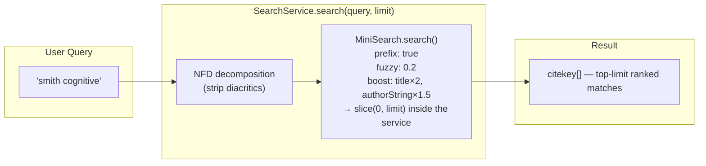

**Indexed fields:** `title`, `authorString`, `year`, `id`, `zoteroId`, `notesText`

`notesText` is built by `Entry.noteExcerpt()` — the raw note segments are truncated (with headroom) BEFORE the entity-decoding regex pipeline runs, so indexing never regexes megabytes of highlights, and capped at `Entry.MAX_NOTES_INDEX_CHARS` to bound index size. It lets a query that appears only inside a Readwise highlight or BibTeX note still match the entry. **Boosts:** `title` ×2, `authorString` ×1.5, `notesText` ×0.5 — so title/author matches always rank above highlight-only matches.

### Index Build (off the main thread)

Index/search options live in `src/search/search-index.ts` — the single source
of truth shared by the main thread and the worker (MiniSearch requires
identical options for `loadJSON`).

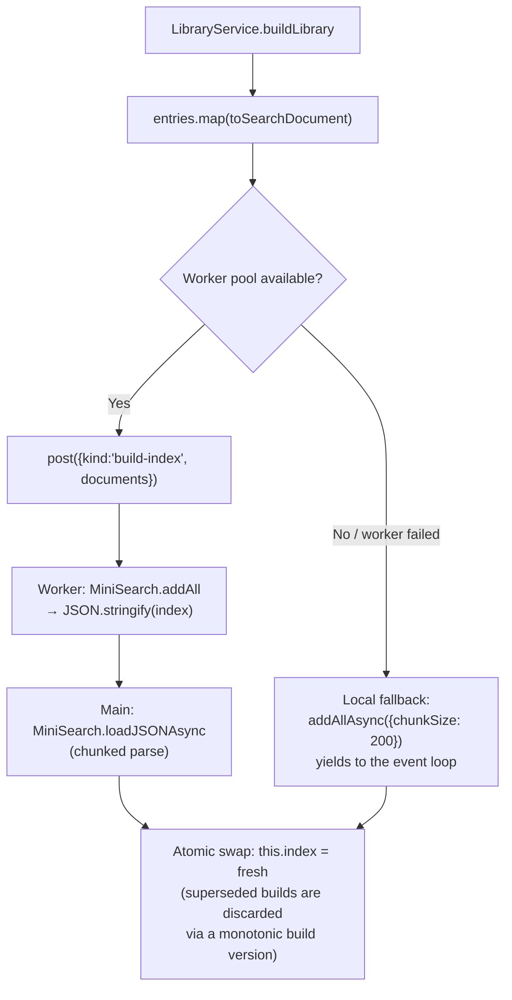

Searches keep hitting the previous index until the swap, so a rebuild never
blanks or blocks the search modal. `buildIndex` receives the load's
`AbortSignal`: a superseded load's worker-side build is terminated outright
(freeing the pool slot) instead of running to completion just to be
discarded. `LibraryService` additionally caches the
sorted entry list per sort order (`getSortedEntries`), invalidated on each
build — the modal's empty-query path is an O(1) slice instead of an
O(N log N) sort per keystroke.

---

## Action System

`ActionRegistry` is the single source of truth for all user-facing actions. `CommandRegistry` and `ContextMenuHandler` are thin presentation adapters that read from it.

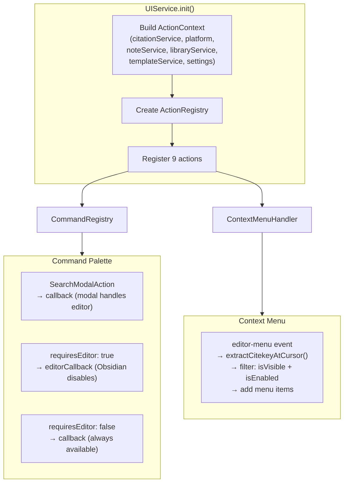

### Action Hierarchy

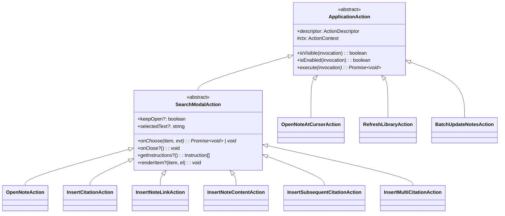

### Registered Actions

| Action                | ID                               | Palette | Menu | Editor | Type        |
| --------------------- | -------------------------------- | ------- | ---- | ------ | ----------- |
| Open Literature Note  | `open-literature-note`           | Yes     | Yes  | No     | SearchModal |
| Insert Citation       | `insert-markdown-citation`       | Yes     | No   | Yes    | SearchModal |
| Insert Note Link      | `insert-citation`                | Yes     | Yes  | Yes    | SearchModal |
| Insert Note Content   | `insert-literature-note-content` | Yes     | No   | Yes    | SearchModal |
| Insert Subsequent     | `insert-subsequent-citation`     | Yes     | No   | Yes    | SearchModal |
| Insert Multi-Citation | `insert-multiple-citations`      | Yes     | No   | Yes    | SearchModal |
| Open Note at Cursor   | `open-note-at-cursor`            | Yes     | No   | Yes    | Direct      |
| Refresh Library       | `update-bib-data`                | Yes     | No   | No     | Direct      |
| Batch Update Notes    | `batch-update-notes`             | Yes     | No   | No     | Direct      |

### ActionContext

Every action receives an `ActionContext` with explicit dependencies — no access to the Plugin object:

```typescript
interface ActionContext {
  readonly citationService: ICitationService;
  readonly platform: IPlatformAdapter;
  readonly noteService: INoteService;
  readonly libraryService: ILibraryService;
  readonly templateService: ITemplateService;
  readonly settings: CitationsPluginSettings;
}
```

### ActionInvocationContext

Runtime context provided when action is triggered. Different surfaces provide different data:

| Surface         | `citekey` | `selectedText` | `entry`        | `event`        |
| --------------- | --------- | -------------- | -------------- | -------------- |
| Command palette | —         | from editor    | —              | —              |
| Context menu    | extracted | —              | —              | —              |
| Search modal    | —         | —              | selected entry | click/keyboard |

### Keyboard Modifiers in Search Modals

| Action         | Default        | Shift              | Ctrl             | Tab            | Shift+Tab |
| -------------- | -------------- | ------------------ | ---------------- | -------------- | --------- |
| OpenNote       | Open note      | —                  | Open in new pane | Open in Zotero | Open PDF  |
| InsertCitation | Primary format | Alternative format | —                | —              | —         |
| InsertMulti    | Accumulate     | Finalize           | —                | —              | —         |

---

## Template System

`TemplateService` uses an isolated Handlebars instance with compiled template caching and custom helpers.

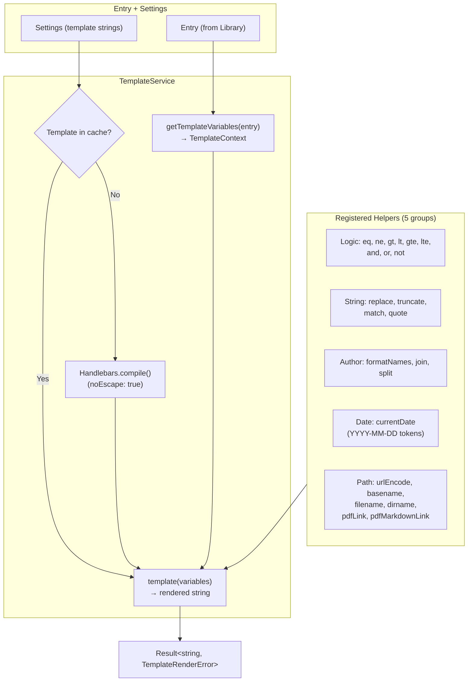

### Template Variables

Built from `Entry` fields and extras:

| Variable               | Source                   | Example                                 |
| ---------------------- | ------------------------ | --------------------------------------- |
| `citekey`              | `entry.id`               | `smith2020`                             |
| `title`                | `entry.title`            | `Cognitive Architecture`                |
| `authorString`         | `entry.authorString`     | `Smith, J. and Doe, A.`                 |
| `year`                 | `entry.year`             | `2020`                                  |
| `date`                 | `entry.issuedDate` (ISO) | `2020-03-15`                            |
| `DOI`, `ISBN`, `URL`   | direct fields            |                                         |
| `abstract`, `keywords` | direct fields            |                                         |
| `entry`                | `entry.toJSON()`         | Full object for `{{entry.customField}}` |
| `selectedText`         | from editor selection    |                                         |

### Content Template Resolution

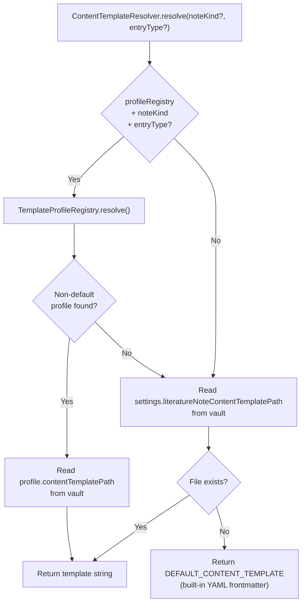

### Template Profile Resolution

`TemplateProfileRegistry` resolves profiles with 3-level precedence:

1. **Exact match** — `noteKind` matches AND `entryTypes` includes the specific `entryType`
2. **Wildcard match** — `noteKind` matches AND `entryTypes` includes `'*'`
3. **Default profile** — always returns `DEFAULT_PROFILE`

```typescript
// Built-in defaults
DEFAULT_NOTE_KIND = { id: 'literature-note', name: 'Literature Note', folder: 'Reading notes' }
DEFAULT_PROFILE = { id: 'default', noteKind: 'literature-note', entryTypes: ['*'],
                    titleTemplate: '@{{citekey}}', contentTemplatePath: 'citation-content-template.md' }
```

### IntrospectionService

Discovers available template variables for UI documentation:

1. **Static catalogue** — 30+ known variables with hardcoded descriptions
2. **Runtime sampling** — samples up to 50 library entries via `entry.toJSON()` to discover dynamic properties
3. **Example extraction** — captures first non-null value for each variable

Filters: skips `_`-prefixed fields (internal), functions, complex objects.

---

## Note Service

`NoteService` manages literature note CRUD: path resolution, folder creation, file lookup, creation, and opening.

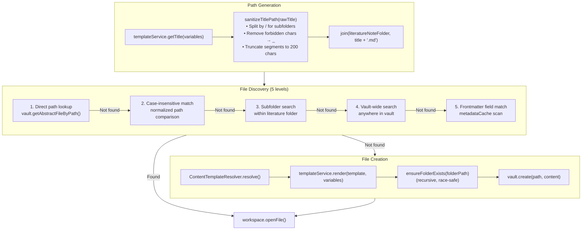

### File Discovery Strategy

The 5-level lookup handles real-world scenarios:

| Level             | Why needed                                                               |
| ----------------- | ------------------------------------------------------------------------ |
| Direct path       | Fast path for normal case                                                |
| Case-insensitive  | macOS/Windows filesystems are case-insensitive                           |
| Subfolder search  | User manually moved note to a subfolder                                  |
| Vault-wide        | User moved note completely outside literature folder                     |
| Frontmatter field | User renamed note; configurable field (e.g. `citekey`) via metadataCache |

### Auto-Creation Control

`openLiteratureNote()` respects `settings.disableAutomaticNoteCreation`:
- If **true**: only opens existing notes; throws `LiteratureNoteNotFoundError` if missing
- If **false**: creates note if missing (default behavior)

---

## Batch Update

`BatchNoteOrchestrator` performs bulk updates of existing literature notes when the content template changes.

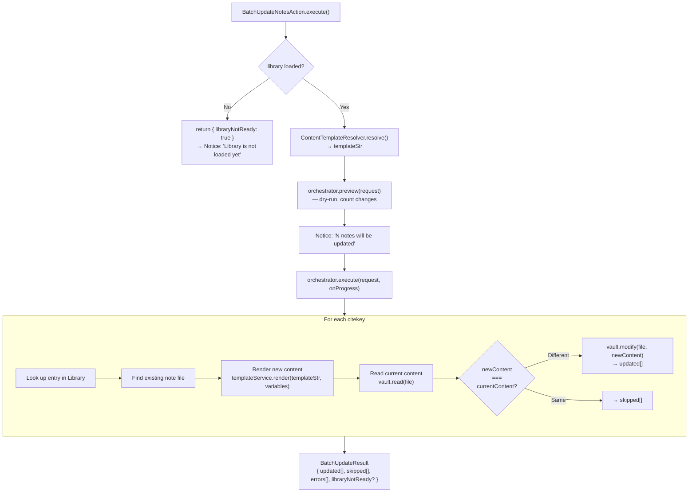

### Request / Result Types

```typescript
interface BatchUpdateRequest {
  citekeys: string[];     // ['key1', 'key2'] or ['*'] for all
  templateStr: string;    // Content template to render
  dryRun: boolean;        // Preview mode — no file writes
}

interface BatchUpdateResult {
  updated: string[];
  skipped: string[];
  errors: Array<{ citekey: string; error: string }>;
  libraryNotReady?: boolean;
}

interface BatchUpdateProgress {
  current: number;         // 1-based index
  total: number;
  currentCitekey: string;
}
```

---


## Readwise Integration

The plugin can import highlights and documents from Readwise as an additional citation database. Readwise follows the **same worker pipeline** as file-based sources — API responses are serialized to JSON, posted to the Web Worker for parsing, and converted to Entry objects via the adapter factory. This ensures a single, consistent data flow for all formats.

### Components

| Component           | Location             | Depends on Obsidian? | Role                                                                            |
| ------------------- | -------------------- | -------------------- | ------------------------------------------------------------------------------- |
| `ReadwiseApiClient` | `src/core/readwise/` | No                   | Pure HTTP client: auth, pagination, rate-limit retry                            |
| `ReadwiseAdapter`   | `src/core/adapters/` | No                   | Entry subclass mapping Readwise data to unified Entry interface                 |
| `ReadwiseSource`    | `src/sources/`       | No                   | DataSource implementation — calls API, posts to worker pipeline                 |
| `parseReadwise`     | `src/core/parsing/`  | No                   | Registered in `FORMAT_PARSERS` — deserializes JSON array of `ReadwiseEntryData` |

### Data Flow

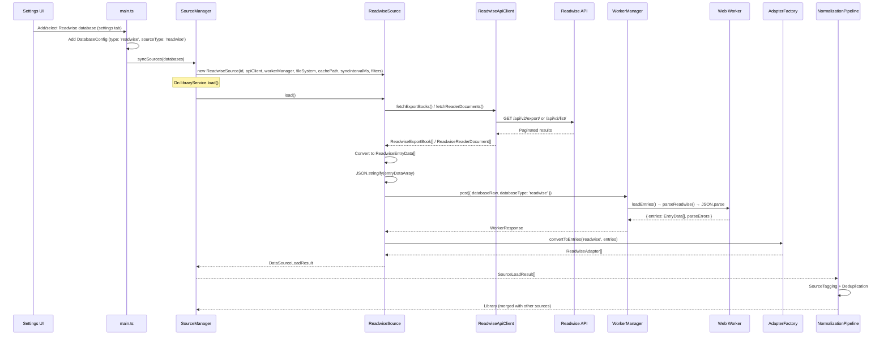

### Database Format

Readwise uses a single database format: `'readwise'`. The internal mode (`readwise-highlights` or `reader-documents`) is an implementation detail of `ReadwiseSource` — it determines which API endpoint to call, but does not affect the database type in settings.

### Two Modes (internal to ReadwiseSource)

| Mode                  | API                           | Citekey Format      | Data Shape                   |
| --------------------- | ----------------------------- | ------------------- | ---------------------------- |
| `readwise-highlights` | v2 Export (`/api/v2/export/`) | `rw-{user_book_id}` | Books with nested highlights |
| `reader-documents`    | v3 Reader (`/api/v3/list/`)   | `rd-{document_id}`  | Documents with metadata      |

### Structured Highlights

Each entry carries both an aggregated `highlightsText` string (for backward-compatible `{{note}}` templates) and structured `ReadwiseHighlightItem[]` data that the adapter maps into the source-agnostic `annotations` interface (`{{#each annotations}}` — shared with Zotero PDF annotations). Each annotation preserves the highlight `text`, your note as `comment`, `page`/`pageLabel`, `colorName`, `tags`, and `openURI`. v2 Export highlights map directly; v3 Reader child documents are merged in (see below).

### Reader Child-Document Merge

Reader v3 returns highlights/notes as child documents (non-null `parent_id`). `mergeReaderChildren()` groups children by `parent_id` and folds them into the parent's `highlights` array (and aggregated text) instead of dropping them. Children whose parent is outside the fetched set are kept as standalone top-level entries (logged), so no data is silently lost. The merge is deterministic (preserves API order, no time-based sorting).

### Import Filters

A Readwise database may carry optional `readwiseFilters` (`categories`, `tags`, `minHighlights`, `readerLocations`) on its `DatabaseConfig`. `DataSourceDefinition` stays source-agnostic — it carries only a generic `databaseId`; `main.ts` resolves the per-database `readwiseFilters` from settings by that id (`resolveReadwiseFilters`) and injects them into `ReadwiseSource`. `applyReadwiseFilters()` (a pure function) filters the normalized entries at read time — after fetch/merge and on the cache-fallback path — so the offline cache stays full-fidelity and current filters always apply. `minHighlights` applies only to highlight-mode entries; `readerLocations` only to Reader documents.

### Incremental Sync

After the first full download, `load()` fetches only entries updated since the
last clean sync and merges them into the cached full set:

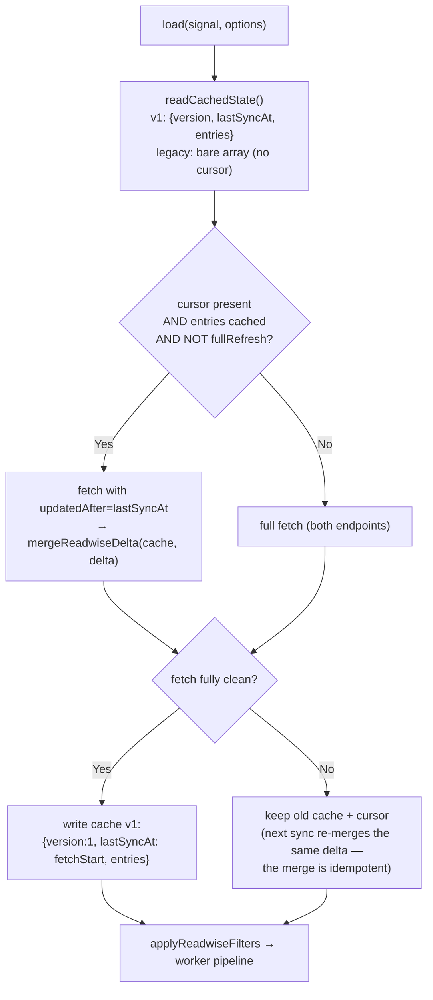

Merge semantics (`src/core/readwise/readwise-delta.ts`, pure functions):

- **v2 Export books** arrive with ONLY the changed highlights — highlight
  items are merged per-id (delta wins), book metadata comes from the delta,
  and the aggregated `highlightsText` is rebuilt from the merged items.
- **Reader v3 documents** arrive whole and replace the cached entry.
- **Reader children without their parent in the delta** are folded into the
  cached parent's highlights; a child with no parent even in the cache stays
  a standalone entry (logged), so no data is silently lost.
- **Deletions are invisible** to `updatedAfter`. The manual "Refresh citation
  database" command passes `fullRefresh: true` through
  `ILibraryService.load` → `DataSourceLoadOptions`, forcing a full re-fetch.

The cursor (`lastSyncAt`) is captured at fetch START (racing updates are
re-delivered, merge is idempotent) and advances only together with a
successful cache write, so the on-disk cursor always matches the on-disk base.
When the cursor is USED, a 5-minute overlap is subtracted from it
(`CURSOR_OVERLAP_MS`): the cursor comes from the local clock while Readwise
compares it against server-side timestamps, and a client clock running ahead
of the server would otherwise silently miss updates. Over-fetching is free
because the merge is idempotent; an unparseable cursor falls back to a full
fetch.

### Periodic Sync Timer

`watch()` uses a chained `setTimeout` that re-reads the sync interval from a
provider function on every cycle — settings changes apply on the next cycle
without recreating the source. Because the source now survives `syncSources`
(fingerprint key), the timer and incremental continuity are no longer reset by
unrelated library reloads.

### Cancellation & Cache

`ReadwiseSource` owns an internal `AbortController` created per `load()` (aborting any previous in-flight fetch) and aborted in `dispose()`, so the API client's abort handling is live and network work stops on reload/unload. The offline cache is per-database — `readwise-cache-<id>.json` keyed by the stable source id — so multiple Readwise databases never collide.

### Rate Limiting

The `ReadwiseApiClient` handles HTTP 429 responses with automatic retry:
- Reads `Retry-After` header (defaults to 60s if missing)
- Up to 3 retries per request
- Supports `AbortSignal` for cancellation during wait

### Security

- API token stored in Obsidian settings (same mechanism as other plugin secrets)
- Token input uses `type="password"` in settings UI
- Token is **never logged** — used only in `Authorization: Token xxx` header
- Token validation endpoint: `GET /api/v2/auth/` (expects 204)

---

## Annotation Model

Annotation-like data from every source (Zotero PDF annotations, Readwise highlights, …) normalizes into one source-agnostic shape in `src/core/types/annotation.ts`. Consumers (templates, the notes layer) read only `entry.annotations` / `entry.attachments` — never a source-specific type and never a database directly. A source with no annotations yields `[]`, so templates guard with `{{#if annotationCount}}` and skip.

```typescript
interface Annotation {
  id: string | null;         // Stable per-source id (used in deep links)
  type: string;              // highlight | underline | note | image | ink | text | …
  text: string;              // Highlighted/quoted text ('' for note/image-only)
  comment: string;           // User's comment/note ('' when none)
  color: string;             // Hex (#ffd400) or source-native token, or ''
  colorName: string | null;  // Palette name (yellow/red/…), or null
  page: number | null;       // 1-based page when derivable, else null
  pageLabel: string;         // Reader-shown label (roman numerals, Kindle "location …", …)
  tags: string[];
  imagePath: string | null;  // Cached image path (image/area annotations), or null
  openURI: string | null;    // Deep link that opens the source at this annotation
  sortIndex: string;         // Opaque key; lexicographic order == document/reading order
  dateModified: string | null;
  source: string;            // 'zotero' | 'readwise' | …
}

interface AttachmentRef {
  id: string | null;
  path: string | null;
  title: string | null;      // File basename without extension
  openURI: string | null;
  annotationCount: number;
}
```

### Two Population Paths

Both stay behind the source boundary, so consumers never learn where the data came from:

| Path                 | Used by                     | Mechanism                                                                                          |
| -------------------- | --------------------------- | -------------------------------------------------------------------------------------------------- |
| **Getter override**  | Readwise (`ReadwiseAdapter`) | Annotations live in the parsed entry; the adapter overrides `get annotations()` and memoizes it     |
| **Source injection** | Zotero (`ZoteroSource`)      | Annotations come from a separate call; the source calls `entry.setAnnotations(annotations, attachments)` |

Injected `_annotations` / `_attachments` are own enumerable fields, so the `NormalizationPipeline`'s `Object.assign(clone, entry, …)` copies them and the prototype getter reads them off the clone — annotations survive tagging and deduplication.

### Zotero PDF Annotation Flow

When **Import PDF annotations** is enabled for a live Zotero (Better BibTeX) database, `ZoteroSource.load()` enriches the parsed entries with native annotations:

```mermaid
flowchart TD
    PULL["fetchBibliography() → raw export"] --> PARSE["parseRaw → Entry[]"]
    PARSE --> FR{"fullRefresh?"}
    FR -->|No| RC["readCache()"]
    FR -->|Yes| SKIP["skip cache read"]
    RC --> REUSE{"cache raw == export\nAND cached attachments?"}
    REUSE -->|Yes| ATTACH1["reuse cached attachments\n(no JSON-RPC)"]
    REUSE -->|No| FETCH["client.fetchAttachmentsForCitekeys\n(batched item.attachments, 50/POST)"]
    SKIP --> FETCH
    FETCH --> NORM["normalizeZoteroAttachments\n→ setAnnotations(entry)"]
    ATTACH1 --> WRITE
    NORM --> WRITE["writeCache(raw, attachments)"]
```

- **Batching** — citekeys are fetched via batched JSON-RPC `item.attachments` (50 per POST). BBT answers each key independently: a citekey that cannot be resolved yields a per-key error while the rest succeed.
- **Best-effort** — a transport failure (Zotero closed, HTTP error) degrades to a load warning (added to `parseErrors`), never a failed load; the bibliography stays usable. The last good attachment payload is carried forward so a failed fetch never clobbers the cache with an empty set.
- **Reuse vs. refresh** — a periodic load whose export is byte-identical to the cache reuses the cached attachments (an annotation edit does not change the export body). The manual "Refresh citation database" (`fullRefresh`) always re-fetches so new highlights are picked up.
- **Offline cache** — the cache carries an optional `attachments` payload written as an OPTIONAL superset on a `version: 1` record (a rolled-back build ignores unknown fields), keyed by the stable `databaseId` (see `sourceCacheFilePath`) with the pre-upgrade source-key path read as a fallback. A legacy-path hit triggers a one-time rewrite to the stable-id filename.

---

## Settings & Configuration

### Zod Schema

All settings are validated on load via Zod. Invalid values fall back to defaults with a console warning.

| Setting                               | Type                | Default          |
| ------------------------------------- | ------------------- | ---------------- |
| `databases`                           | `DatabaseConfig[]`  | `[]`             |
| `literatureNoteTitleTemplate`         | `string` (min 1)    | `@{{citekey}}`   |
| `literatureNoteFolder`                | `string`            | `Reading notes`  |
| `literatureNoteContentTemplatePath`   | `string`            | `''`             |
| `citationStylePreset`                 | `enum`              | `custom`         |
| `markdownCitationTemplate`            | `string` (min 1)    | `[@{{citekey}}]` |
| `alternativeMarkdownCitationTemplate` | `string` (min 1)    | `@{{citekey}}`   |
| `referenceListSortOrder`              | `enum`              | `default`        |
| `autoCreateNoteOnCitation`            | `boolean`           | `false`          |
| `literatureNoteLinkDisplayTemplate`   | `string`            | `''`             |
| `disableAutomaticNoteCreation`        | `boolean`           | `false`          |
| `templateProfiles`                    | `TemplateProfile[]` | `[]`             |

### Citation Style Presets

| Preset      | Primary                        | Alternative      |
| ----------- | ------------------------------ | ---------------- |
| `textcite`  | `{{authorString}} ({{year}})`  | `[@{{citekey}}]` |
| `parencite` | `({{authorString}}, {{year}})` | `[@{{citekey}}]` |
| `citekey`   | `[@{{citekey}}]`               | `@{{citekey}}`   |
| `custom`    | User-defined                   | User-defined     |

### Settings Tab Auto-Reload

The settings UI triggers library reload on structural changes:

| Change          | Reload?         | Mechanism                                 |
| --------------- | --------------- | ----------------------------------------- |
| Database type   | Immediate       | `libraryService.load()` + Notice          |
| Database path   | Debounced (2 s) | Only after successful path validation     |
| Remove database | Immediate       | `libraryService.load()`                   |
| Add database    | No              | New DB has empty path; reload on path set |
| Rename database | No              | Display-only; updates on next load        |

---

## Worker Protocol

Parsing and index building run in Web Workers to avoid blocking the UI thread.

```mermaid
sequenceDiagram
    participant DS as DataSource / SearchService
    participant WM as WorkerManager (pool ≤3)
    participant W as Web Worker

    DS->>WM: post({ kind, ... }, signal?, transfer?)
    Note over WM: Assign to an idle worker<br/>(create lazily up to the cap,<br/>queue when saturated)

    WM->>W: postMessage({ id, request }, transfer)
    Note over W: kind 'parse':<br/>ArrayBuffer → TextDecoder (in worker)<br/>BibTeX → @retorquere/bibtex-parser<br/>CSL-JSON / Readwise → JSON.parse<br/>Hayagriva → YAML parser<br/>kind 'build-index':<br/>MiniSearch.addAll → JSON

    W-->>WM: { id, result } | { id, error }

    alt AbortSignal fired mid-flight
        Note over WM: worker.terminate() — REAL cancellation,<br/>worker replaced lazily
        WM-->>DS: reject DOMException('Aborted')
    else Success
        WM-->>DS: resolve WorkerResponse
    end
```

**WorkerManager** maintains a small pool (up to `min(3, cores − 1)` workers,
created lazily). Multiple databases parse **in parallel** — load time is the
maximum of the parses, not their sum. The RPC envelope (`{ id, request }` /
`{ id, result | error }`) is hand-rolled deliberately: the previously used
`promise-worker` library supports neither transferable objects, nor pooling,
nor real cancellation. Aborting a task terminates its worker immediately,
which both stops the CPU burn and prevents the old "stale parse blocks the
queue" failure mode.

**Transferables:** `LocalFileSource` passes the raw file `ArrayBuffer` as a
transferable — the buffer moves zero-copy into the worker, which decodes it
there. Large files are no longer decoded on the main thread nor
structured-cloned as strings.

**Task kinds:** `WorkerRequest` is a discriminated union — `parse` (raw
database → `EntryData[]`) and `build-index` (`SearchDocument[]` → serialized
MiniSearch JSON). Adding a kind extends the union and the `handleRequest`
switch in `worker.ts`.

---

## Core Types

### Entry

```typescript
abstract class Entry {
  id: string;                    // Citekey (or composite: citekey@databaseId)
  type: string;                  // article, book, inproceedings, ...
  title?: string;
  author?: Author[];
  authorString?: string;
  issuedDate?: Date;
  containerTitle?: string;
  DOI?: string; ISBN?: string; URL?: string;
  keywords?: string[];
  _sourceDatabase?: string;      // Added by SourceTaggingStep
  _compositeCitekey?: string;    // Added by DeduplicationStep
  _annotations?: Annotation[];   // Injected via setAnnotations (Zotero/BBT)
  _attachments?: AttachmentRef[];// Injected via setAnnotations (Zotero/BBT)

  // Inherited getters
  get citekey(): string;         // Alias for id
  get year(): number | undefined;
  get note(): string;
  get zoteroSelectURI(): string;
  get annotations(): Annotation[];      // Source-agnostic annotations ([] when none)
  get attachments(): AttachmentRef[];   // Source-agnostic attachments ([] when none)
  get annotationCount(): number;        // annotations.length (for {{#if annotationCount}})

  // Domain convenience methods
  yearString(): string;                        // Year as string, or ""
  dateString(): string | null;                 // ISO date "YYYY-MM-DD", or null
  lastname(): string | undefined;              // First author family/literal name
  displayAuthors(maxCount?: number): string;   // Truncated author list with "et al."
  displayKey(): string;                        // Citekey with optional DB prefix
  toSearchDocument(): SearchDocument;          // Flat fields for MiniSearch indexing
  toTemplateContext(extras?): TemplateContext;  // All template shortcut fields
  toJSON(): Record<string, unknown>;           // Full serialized entry (walks the whole prototype chain)
  setAnnotations(a: Annotation[], t: AttachmentRef[]): void;  // Source injection path
}
```

Four format adapters normalize raw data → `Entry`: `CSLAdapter`, `BibLaTeXAdapter`, `HayagrivaAdapter`, `ReadwiseAdapter`.

Domain convenience methods encapsulate presentation and transformation logic in the base class, keeping callers (TemplateService, SearchService, CitationSearchModal) decoupled from raw field-level details. When domain logic changes (e.g. how authors are formatted), only the Entry method needs updating — calling code stays unchanged.

**Annotations are source-agnostic** (see [Annotation Model](#annotation-model)). `entry.annotations` / `entry.attachments` expose one interface regardless of origin, populated through two paths behind the source boundary: adapters whose annotation data lives in the parsed entry (Readwise) **override the getter**; sources whose annotations come from a separate call (Zotero via Better BibTeX JSON-RPC) **inject** them with `setAnnotations()`. `toJSON()` walks the entire prototype chain (not just the immediate prototype), so a multi-level adapter never loses inherited getters; the raw `_annotations` / `_attachments` backing fields are stripped from the serialized output.

### Result&lt;T, E&gt;

```typescript
type Result<T, E = Error> =
  | { ok: true; value: T }
  | { ok: false; error: E }

function ok<T>(value: T): Result<T, never>;
function err<E>(error: E): Result<never, E>;
```

Used instead of `throw` for predictable error handling in template and note operations. Type checker enforces checking `result.ok` before accessing `.value` or `.error`.

### Library

```typescript
interface Library {
  entries: Record<string, Entry>;   // Map citekey → Entry
  size: number;
}
```

---

## Error Handling

All domain errors extend `CitationError` with a `code` string for programmatic matching.

```mermaid
classDiagram
    class Error {
        +message: string
    }

    class CitationError {
        +code: string
    }

    class LibraryNotReadyError {
        code = "LIBRARY_NOT_READY"
    }

    class EntryNotFoundError {
        code = "ENTRY_NOT_FOUND"
        +citekey: string
    }

    class TemplateRenderError {
        code = "TEMPLATE_RENDER_ERROR"
        +templateName?: string
    }

    class LiteratureNoteNotFoundError {
        code = "LITERATURE_NOTE_NOT_FOUND"
        +citekey: string
    }

    class DataSourceError {
        code = "DATA_SOURCE_ERROR"
        +sourceId?: string
    }

    class UnsupportedFormatError {
        code = "UNSUPPORTED_FORMAT"
        +format: string
    }

    class BatchUpdateError {
        code = "BATCH_UPDATE_ERROR"
        +failedCitekeys: string[]
    }

    Error <|-- CitationError
    CitationError <|-- LibraryNotReadyError
    CitationError <|-- EntryNotFoundError
    CitationError <|-- TemplateRenderError
    CitationError <|-- LiteratureNoteNotFoundError
    CitationError <|-- DataSourceError
    CitationError <|-- UnsupportedFormatError
    CitationError <|-- BatchUpdateError
```

### Error Handling Patterns

| Layer             | Pattern                    | Example                                                                                                                                                                                                                 |
| ----------------- | -------------------------- | ----------------------------------------------------------------------------------------------------------------------------------------------------------------------------------------------------------------------- |
| Template/Note ops | `Result<T, E>`             | `render()` returns `Result<string, TemplateRenderError>`                                                                                                                                                                |
| Actions           | `try/catch` → notification | `platform.notifications.show(error.message)`                                                                                                                                                                            |
| Source loading    | Partial failure            | `loadAll()` surfaces a failed source as a synthetic result (empty entries + a parse error) so the failure reaches `state.parseErrors` and the UI, while other sources continue. Throws only when **every** source fails |
| Library loading   | Retry with backoff         | Up to 5 attempts with exponential delay                                                                                                                                                                                 |
| Worker            | Queue + abort              | AbortSignal discards stale results                                                                                                                                                                                      |

---

## Service Contracts

`src/container.ts` defines interfaces for all services, enabling testability and layer decoupling.

| Interface                  | Key Methods                                                                                                          |
| -------------------------- | -------------------------------------------------------------------------------------------------------------------- |
| `ILibraryService`          | `load(isRetry?, options?)`, `getSortedEntries(order)`, `dispose()`, `library`, `state`, `searchService`, `store`     |
| `ITemplateService`         | `render()`, `getTitle()`, `getMarkdownCitation()`, `validate()`, `getTemplateVariables()`                            |
| `INoteService`             | `getPathForCitekey()`, `findExistingLiteratureNoteFile()`, `getOrCreateLiteratureNoteFile()`, `openLiteratureNote()` |
| `ICitationService`         | `getEntry()`, `getMarkdownCitation()`, `getTitleForCitekey()`, `getInitialContentForCitekey()`                       |
| `IBatchNoteOrchestrator`   | `preview(request)`, `execute(request, onProgress?)`                                                                  |
| `IContentTemplateResolver` | `resolve(noteKind?, entryType?)`, `migrateInlineToFile()`, `ensureDefaultTemplate()`                                 |
| `IActionRegistry`          | `register()`, `getAll()`, `getById()`, `getContextMenuActions()`, `getCommandPaletteActions()`                       |
| `ISourceManager`           | `syncSources()`, `loadAll()`, `reloadSources(keys)`, `initWatchers((sourceKey) => void)`, `dispose()`                |
| `ILibraryStore`            | `subscribe(fn)`, `getState()`                                                                                        |

---

## Obsidian API Boundary

Direct `import ... from 'obsidian'` only in:

| File                                   | What it uses                                                                                                 |
| -------------------------------------- | ------------------------------------------------------------------------------------------------------------ |
| `src/platform/obsidian-adapter.ts`     | `App`, `Plugin`, `FileSystemAdapter`, `Vault`, `TFile`, `TFolder`, `MarkdownView`, `Notice`, `normalizePath` |
| `src/sources/local-file-source.ts`     | `FileSystemAdapter`                                                                                          |
| `src/sources/vault-file-source.ts`     | `Vault`, `TFile`                                                                                             |
| `src/services/command-registry.ts`     | `App`, `Plugin`                                                                                              |
| `src/services/context-menu-handler.ts` | `App`, `Plugin`, `Menu`, `Editor`                                                                            |
| `src/ui/`                              | `Modal`, `SuggestModal`, `PluginSettingTab`, `Setting`, `Notice`, `debounce`                                 |
| `src/main.ts`                          | `Plugin`                                                                                                     |

**Never import `obsidian`:** `src/application/`, `src/library/`, `src/notes/`, `src/template/`, `src/core/`, `src/domain/`, `src/search/`, `src/infrastructure/`.
