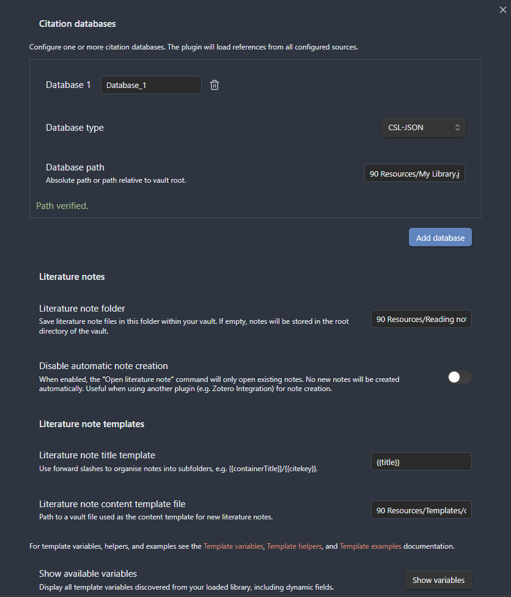
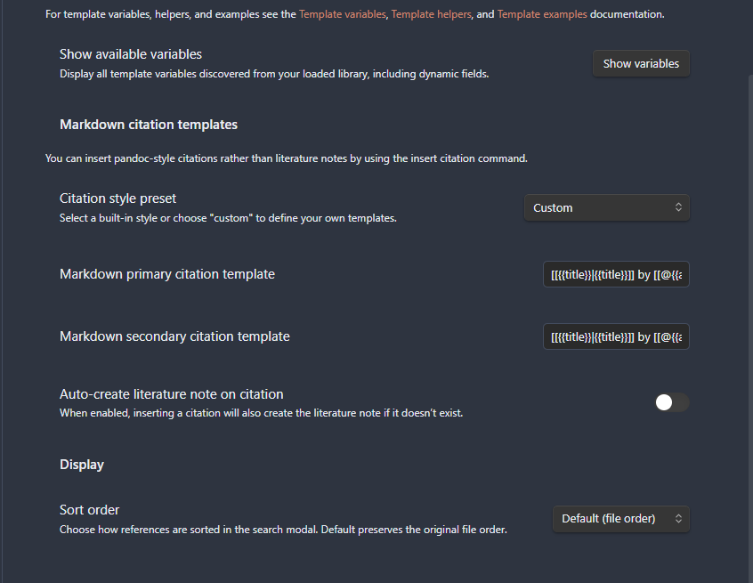
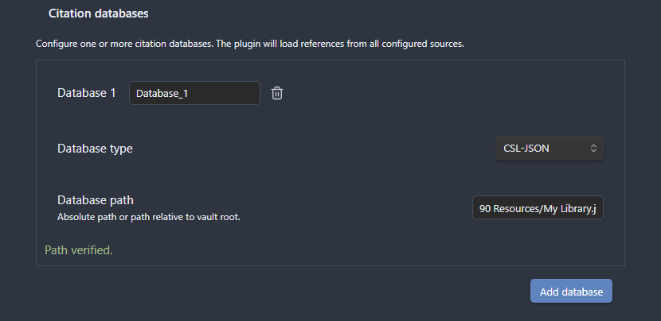
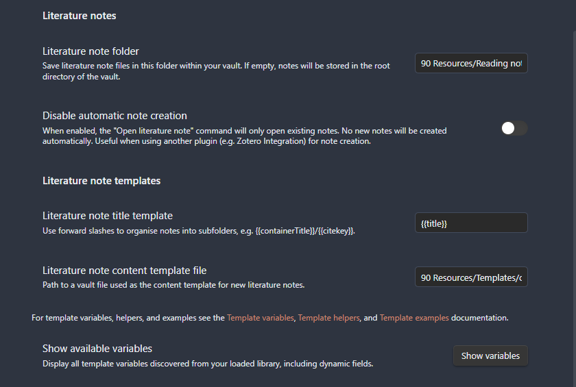
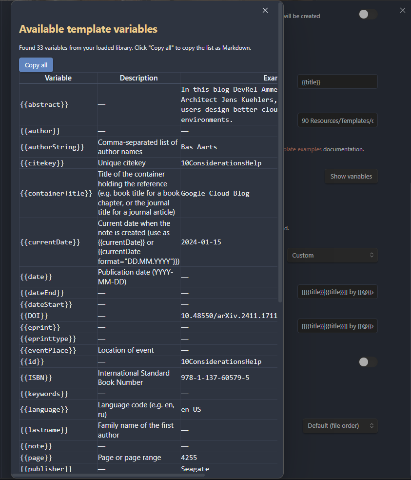
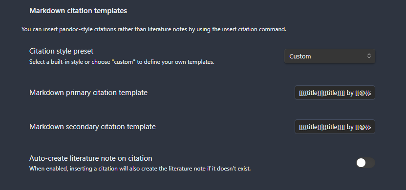
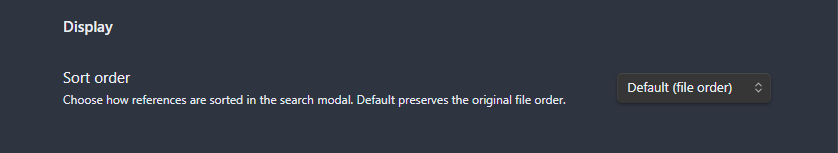

# Configuration

All settings are accessible in **Settings** > **Citation plugin**.




---

## Citation Databases



This section controls where the plugin reads your bibliography data from.

| Setting | Description | Default |
|---------|-------------|---------|
| Database name | Friendly label shown in search modal when the same citekey exists in multiple databases. You can rename a database at any time without breaking existing literature notes or wiki-links | `Database 1` |
| Database type | Format of the bibliography file (see [Database Formats](#database-formats) below). Changing the format triggers an automatic library reload and shows a confirmation notice | `CSL-JSON` |
| Database path | Absolute or vault-relative path to the exported bibliography file. After the path is validated, the library reloads automatically (with a short debounce delay) | (empty) |

- Up to 20 databases supported
- Each database receives a stable internal identifier on creation. This identifier is invisible to the user but ensures that renaming a database does not break composite citekeys or literature note links
- When the same citekey appears in multiple databases, both entries are kept with a `database:citekey` display prefix in the search modal
- Path validation runs automatically and shows "Path verified" or "File not found"
- Removing a database immediately triggers a library reload so the search index reflects the change

### Database Formats

**CSL-JSON** (`.json`) — The Citation Style Language JSON format. This is a standardized, lightweight format that most reference managers can export. It loads quickly and is the recommended choice for most users.

- **Best for:** Zotero (via "Export Library" → CSL JSON), Mendeley, Paperpile
- **Advantages:** Fast parsing, standard format, smaller file size
- **Limitations:** May not include all custom fields (e.g. PDF file paths, Zotero notes)

**BibLaTeX** (`.bib`) — A LaTeX bibliography format that carries richer metadata than CSL-JSON, including PDF file paths, keywords, abstract, and annotation notes. Parsing is slower because the BibTeX grammar is more complex.

- **Best for:** Zotero with [Better BibTeX](https://retorque.re/zotero-better-bibtex/) plugin, LaTeX users
- **Advantages:** Richer metadata (PDF paths, keywords, notes), seamless LaTeX integration
- **Limitations:** Slower to parse on large libraries (5000+ entries), larger file size
- **Note:** "Better BibTeX" refers to the Zotero plugin that exports `.bib` files; the database type in settings is called `BibLaTeX`

### Setting Up Multiple Databases

To use more than one bibliography source (e.g. personal library + shared team library):

1. Open **Settings** > **Citation plugin** > **Citation Databases**
2. Your first database is already configured — enter its name, type, and path
3. Click **Add database** to add a second entry
4. Give each database a unique name (this label appears in the search modal for duplicates)
5. If both databases contain the same citekey, the **merge strategy** controls which entry is used for note creation (see [Data Sources: Merge Strategies](data-sources.md#merge-strategies))


---

## Readwise Integration

Connect the plugin to your Readwise account to import highlights and documents as citable entries. Readwise is configured as a regular database in the **Citation databases** section -- there is no separate settings panel.

### Adding a Readwise Database

1. Open **Settings** > **Citation plugin** > **Citation databases**
2. Click **Add database**
3. In the new database card, change the **Database type** dropdown to **Readwise**
4. The card now shows Readwise-specific fields instead of a file path

### Readwise Database Card Settings

| Setting / Button | Description |
|------------------|-------------|
| **Database name** | Friendly label for this database (default: `Database N`). You can rename it to `Readwise` or any name you prefer |
| **Database type** | Must be set to **Readwise** |
| **API token** | Your Readwise access token (password field). Get it from [readwise.io/access_token](https://readwise.io/access_token). Stored in plugin settings |
| **Validate token** | Tests the API token against Readwise. Shows "Token is valid" or "Token is invalid" |
| **Sync now** | Fetches data from both Readwise APIs and reloads the library. Updates the "Last sync" timestamp shown below the token field |

### How It Works

When a Readwise database is configured with a valid API token, clicking **Sync now** fetches data from both Readwise APIs in parallel:

- **v2 Export API** -- books with nested highlights (Kindle, Instapaper, etc.). Entries use citekeys like `rw-12345`
- **v3 Reader API** -- documents, articles, and PDFs saved in Readwise Reader. Entries use citekeys like `rd-abc123`

Both sets of entries are merged into a single database. There is no mode selector -- the plugin always loads from both APIs automatically.

Readwise entries support all standard plugin features: citation insertion, literature note creation, templates, and batch operations. See the [Readwise Integration use case](use-cases/readwise-integration.md) for a complete walkthrough.

### Offline Cache

After each successful sync, the plugin saves Readwise data to a local cache file at `.obsidian/plugins/citation-extended/readwise-cache.json`. If the Readwise API is unavailable on the next load (e.g., no network connection), the plugin falls back to the cached data automatically. A warning notice appears when cached data is used instead of a fresh API response.

The cache file is managed automatically -- you do not need to create or edit it. It is overwritten on every successful sync.

---

## Hotkeys

The plugin registers eight commands but does **not** assign default hotkeys — you choose bindings that fit your workflow. To configure:

1. Open **Settings** > **Hotkeys**
2. Search for `Citations`
3. Click the `+` button next to any command to assign a key combination

**Recommended bindings** (adjust to taste):

| Command | Suggested hotkey | Rationale |
|---------|-----------------|-----------|
| Open literature note | `Ctrl+Shift+O` | Mnemonic: **O**pen note |
| Insert Markdown citation | `Ctrl+Shift+E` | Quick citation insertion while writing |
| Insert literature note link | `Ctrl+Shift+L` | Mnemonic: **L**ink |
| Open literature note for citation at cursor | `Ctrl+Shift+G` | No modal — jumps directly to the note for the citation under cursor |
| Insert subsequent citation | — | Appends `; @key2` to an existing `[@key1]` at cursor |
| Insert multiple citations | — | Multi-select modal: add references one by one, insert combined `[@...]` on close |
| Insert literature note content | — | Used less frequently, assign if needed |
| Refresh citation database | — | Rarely needed (auto-reload handles most cases) |

---

## Literature Notes



This section controls how literature notes are created, named, and where they are stored.

| Setting | Description | Default |
|---------|-------------|---------|
| Literature note folder | Folder inside the vault where new notes are created | `Reading notes` |
| Disable automatic note creation | When enabled, only opens existing notes — never creates new ones | `false` |
| Literature note title template | Handlebars template for the note filename (without `.md` extension) | `@{{citekey}}` |
| Literature note content template file | Path to a vault file used as the note body template | (empty) |

### Literature note folder

The folder path is relative to the vault root. If the folder doesn't exist, it will be created when the first note is saved. Examples:

- `Reading notes` — notes saved to `<vault>/Reading notes/@smith2023.md`
- `References/Literature` — nested folder structure
- (empty) — notes saved directly in vault root

### Disable automatic note creation

When **off** (default): selecting a reference in the search modal creates a new note if one doesn't exist yet. When **on**: the command only opens existing notes and shows an error if no note exists for the selected reference. Useful when you create notes via another plugin (e.g. Zotero Integration) and only want to open them through this plugin.

### Literature note title template

A Handlebars template that produces the filename (without `.md`). The default `@{{citekey}}` creates files like `@smith2023.md`.

**Common patterns:**

| Template | Result | Use case |
|----------|--------|----------|
| `@{{citekey}}` | `@smith2023.md` | Default, easy to identify |
| `{{citekey}}` | `smith2023.md` | Without @ prefix |
| `{{lastname}} {{year}} — {{titleShort}}` | `Smith 2023 — Attention.md` | Human-readable |
| `{{type}}/{{citekey}}` | `article-journal/@smith2023.md` | Subfolder by type |

### Literature note content template file

Path to a Markdown file in your vault that serves as the template body. This is the recommended approach — it lets you edit the template as a normal note with full syntax highlighting. If the path is empty, an empty note body is created.

**How to set up:**

1. Create a new note in your vault (e.g. `Templates/literature-note.md`)
2. Write your template using Handlebars syntax (see [Template Examples](templates/examples.md))
3. Enter the path `Templates/literature-note.md` in this setting

> **Migration note:** Earlier versions of the plugin used an inline text field for the content template. If you upgrade from an older version, the plugin automatically migrates your inline template to a vault file and sets the path for you.

### Show available variables

Click the **Show variables** button to open a modal listing all template variables discovered from your loaded library, including dynamic fields from your bibliography. You can copy the full list as a Markdown table.



### Subfolder Support

Use forward slashes in the title template to organize notes into subfolders:

```handlebars
{{type}}/{{citekey}}
```

This creates notes like `Reading notes/article-journal/@smith2023.md`. Missing folders are created automatically.

The plugin searches recursively in subfolders when opening notes, so manually moved notes are still found. If a note is moved completely outside the literature note folder (e.g. into a project-specific folder), the plugin performs a vault-wide search as a last resort before creating a duplicate.

See [Template Examples: Subfolder Organization](templates/examples.md#subfolder-organization) for more patterns.

---

## Markdown Citations



This section controls what text is inserted when you use the **Insert Markdown citation** command.

| Setting | Description | Default |
|---------|-------------|---------|
| Citation style preset | Built-in style or custom (see table below) | `custom` |
| Primary citation template | Template for the main citation format | `[@{{citekey}}]` |
| Secondary citation template | Template for the alternative format (activated by **Shift+Enter** in the search modal) | `@{{citekey}}` |
| Auto-create literature note on citation | Create the literature note file when inserting a citation, if it doesn't exist yet | `false` |
| Literature note link display template | Custom Handlebars template for the display text of inserted literature note links. Leave empty to use defaults (citekey for Markdown, title for Wiki) | (empty) |

### Citation style preset

Select a built-in style to auto-fill both template fields, or choose `custom` to define your own. When a preset is active, the template fields are disabled — switch to `custom` to edit them.

| Preset | Primary | Alternative | Use case |
|--------|---------|-------------|----------|
| textcite | `{{authorString}} ({{year}})` | `[@{{citekey}}]` | In-text narrative citation: "Smith (2023) showed that..." |
| parencite | `({{authorString}}, {{year}})` | `[@{{citekey}}]` | Parenthetical citation: "...as shown (Smith, 2023)" |
| citekey | `[@{{citekey}}]` | `@{{citekey}}` | Pandoc-compatible: compile Markdown to PDF/DOCX with citeproc |
| custom | User-defined | User-defined | Full control over both templates |

### Primary vs secondary citation

- **Primary**: inserted when you press **Enter** in the search modal
- **Secondary**: inserted when you press **Shift+Enter** — use it for an alternative format (e.g. switch between `[@smith2023]` and `Smith (2023)`)

### Auto-create literature note on citation

When **on**: inserting a citation also creates the literature note file if it doesn't exist. When **off** (default): only the citation text is inserted, no note file is created. Enable this if you want every cited reference to have a corresponding note.

### Literature note link display template

Controls the display text shown in links inserted by the **Insert literature note link** command. Leave empty to use the defaults:

- **Markdown links** (`[display](path)`): display text = citekey (e.g. `[smith2023](notes/smith2023.md)`)
- **Wiki links** (`[[path]]`): display text = note title

When a template is set, it is rendered with all template variables (just like citation templates) and used as the display text for both link formats. For wiki links, the alias syntax `[[path|display]]` is used.

**Common patterns:**

| Template | Result (Markdown) | Result (Wiki) |
|----------|-------------------|---------------|
| (empty — default) | `[smith2023](path)` | `[[path]]` |
| `{{authorString}} ({{year}})` | `[Smith, Jones (2023)](path)` | `[[path\|Smith, Jones (2023)]]` |
| `{{titleShort}}` | `[Attention](path)` | `[[path\|Attention]]` |
| `@{{citekey}}` | `[@smith2023](path)` | `[[path\|@smith2023]]` |

---

## Display



| Setting | Description | Default |
|---------|-------------|---------|
| Sort order | How references are sorted in the search modal | `Default (file order)` |

### Sort order options

| Option | Behavior |
|--------|----------|
| Default (file order) | Entries appear in the order they are stored in the bibliography file |
| By year (newest first) | Most recent publications first — useful for finding recent references quickly |
| By year (oldest first) | Oldest publications first — useful for chronological review |
| By author (A to Z) | Alphabetical by first author's last name |

Entries missing the sort field (e.g. no year) are placed at the end of the list.
