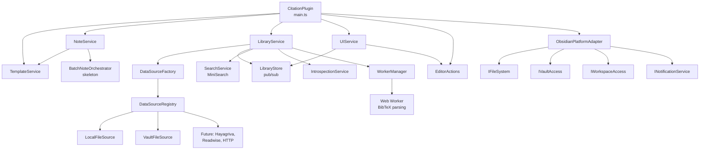

# Development Guide

## Architecture Overview



## Module Structure

```
src/
  platform/           # Obsidian API isolation layer
  core/               # Domain types, errors, Result, adapters
  sources/            # DataSource implementations + registry
  library/            # Library loading, store, merge strategy
  search/             # MiniSearch full-text index
  template/           # Handlebars rendering + helpers
  notes/              # Note CRUD + batch update skeleton
  ui/                 # Settings, modals, editor actions
  services/           # UIService (commands, status bar)
```

## Key Patterns

### DataSource Registry (Open/Closed)

New data sources are registered without modifying existing code:

```typescript
// In main.ts onload()
const registry = new DataSourceRegistry();
registry.register('local-file', (def, id) => new LocalFileSource(...));
registry.register('vault-file', (def, id) => new VaultFileSource(...));

// Future: third-party or plugin-added sources
registry.register('hayagriva', (def, id) => new HayagrivaSource(...));
```

### Result Type

Expected errors use discriminated unions instead of exceptions:

```typescript
const result = templateService.render(template, variables);
if (result.ok) {
  // result.value is the rendered string
} else {
  // result.error is a TemplateRenderError
}
```

### Platform Adapter

All Obsidian API access goes through `IPlatformAdapter`:

```typescript
// Instead of: this.app.vault.create(path, content)
// Use:        this.platform.vault.create(path, content)

// Instead of: new Notice(message)
// Use:        this.platform.notifications.show(message)
```

This enables testing services without Obsidian runtime.

## Adding a New Data Source

1. Create `src/sources/my-source.ts` implementing `DataSource`:

```typescript
export class MySource implements DataSource {
  readonly id: string;
  constructor(id: string, ...) { this.id = id; }
  async load(): Promise<DataSourceLoadResult> { ... }
  watch(callback: () => void): void { ... }
  dispose(): void { ... }
}
```

2. Register in `main.ts`:

```typescript
registry.register('my-source', (def, id) => new MySource(id, def.path, ...));
```

3. Add type label in `src/core/types/database.ts`:

```typescript
export const DATABASE_TYPE_LABELS: Record<DatabaseType, string> = {
  ...existing,
  'my-format': 'My Format',
};
```

4. Add tests in `tests/sources/my-source.spec.ts`.

## Adding a Template Helper

1. Create or extend a file in `src/template/helpers/`:

```typescript
hbs.registerHelper('myHelper', (value: string) => {
  return value.toUpperCase();
});
```

2. Register in `src/template/helpers/index.ts`
3. Add tests in `tests/template/template.helpers.spec.ts`
4. Document in `docs/templates/helpers.md`

## Running Tests

```bash
npm test                  # Full suite
npm test -- --watch       # Watch mode
npm test -- path/to/file  # Single file
npm test -- --coverage    # Coverage report
```

## Building

```bash
npm run dev    # Watch mode (rebuilds on change)
npm run build  # Production build → dist/
npm run lint   # ESLint check
```

## Contributing

1. Fork and create a feature branch
2. Follow existing code patterns (Result type, DI, no `any`)
3. Write tests for new functionality
4. Run `npm run lint && npm test && npm run build`
5. Submit a PR against `master`
