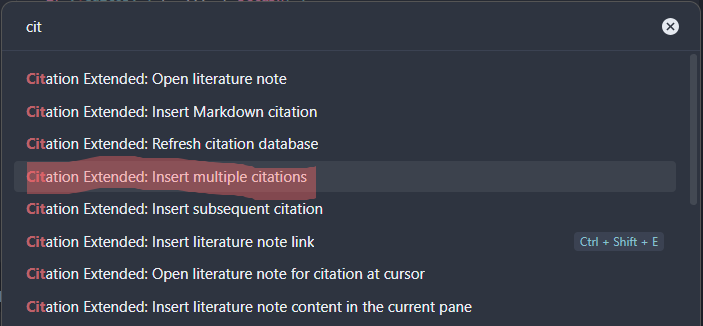
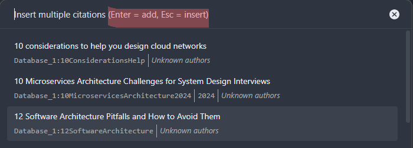

# Features

The plugin provides commands accessible via the Command Palette (`Ctrl+P`) or custom hotkeys, plus an inline autocomplete and a references sidebar. No hotkeys are assigned by default — configure them in **Settings** > **Hotkeys** > search for "Citations". See [Configuration: Hotkeys](configuration.md#hotkeys) for recommended bindings.

Commands that require an active editor (Insert citation, Insert note link, Insert note content, Insert subsequent citation, Insert multiple citations, Open note for citation at cursor) are automatically greyed out in the Command Palette when no editor pane is open.

## Open Literature Note

Opens (or creates) a literature note for a selected reference.

- **Command**: `Citations: Open literature note`
- **Suggested hotkey**: `Ctrl+Shift+O`
- The title, folder, and content are configured in settings
- If "Disable automatic note creation" is enabled, only existing notes are opened
- Notes can be organized in subfolders using `/` in the title template (e.g. `{{type}}/{{citekey}}`)
- Illegal filename characters (`: * ? " < > |`) are replaced with a configurable string (default `_`); see [Filename sanitization replacement](configuration.md#filename-sanitization-replacement)

**How it works:** A search modal opens where you type to find a reference by title, author, year, or citekey. Press Enter to open the corresponding literature note. If the note doesn't exist, it's created from your content template.

## Insert Literature Note Link

Inserts a wiki-link or markdown link to a literature note at the cursor position.

- **Command**: `Citations: Insert literature note link`
- **Suggested hotkey**: `Ctrl+Shift+L`
- Respects your vault's link format preference (wiki `[[…]]` vs markdown `[…](…)`)
- If the note doesn't exist, it is created automatically (unless disabled in settings)
- **Markdown links** use the citekey as display text: `[smith2023](path/to/note.md)` — this preserves special characters (colons, slashes) that would be stripped from filenames
- **Wiki links** use the note title: `[[Reading notes/@smith2023]]`
- **Custom display text**: set `Literature note link display template` in settings to use a Handlebars template like `{{authorString}} ({{year}})` for both link types (see [Configuration](configuration.md#literature-note-link-display-template))

**How it works:** Select a reference from the search modal, and a link to its literature note is inserted where your cursor was. Useful for referencing sources inline while writing.

## Insert Literature Note Content

Inserts the rendered content template at the cursor position without creating a separate note file.

- **Command**: `Citations: Insert literature note content`
- Useful for adding reference metadata (frontmatter, abstract, etc.) to an existing note
- After insertion, the cursor moves to the end of the inserted text

**How it works:** Select a reference, and the content template is rendered and inserted at your cursor. This is different from "Open Literature Note" — it doesn't create a file, it pastes content inline.

## Insert Markdown Citation

Inserts a formatted citation string (e.g. `[@smith2023]`) at the cursor position.

- **Command**: `Citations: Insert Markdown citation`
- **Suggested hotkey**: `Ctrl+Shift+E`
- Supports **primary** and **secondary** citation formats
- Press **Shift+Enter** in the search modal to use the secondary (alternative) format
- Citation style presets available: textcite, parencite, citekey, or custom (see [Configuration: Citation Style Presets](configuration.md#citation-style-presets))
- Optionally auto-creates the literature note on citation (configurable)
- Cursor moves to end of inserted citation for easy chaining

**How it works:** Open the search modal, pick a reference, and the citation string is inserted at your cursor. Hold Shift when pressing Enter to use the alternative format — e.g. switch between `[@smith2023]` (primary) and `@smith2023` (secondary).

## Inline Citation Autocomplete

Suggests matching references as you type a citation directly in the editor — no modal required.

- Trigger by typing `@` or `[@` followed by your query (title, author, year, or citekey)
- Suggestions are ranked by the same fuzzy, accent-insensitive search index used by the search modal
- Press **Enter** to insert the primary Markdown citation format; **Shift+Enter** for the alternative format
- The typed trigger (including a leading `[`) is replaced by the rendered citation, so a `[@citekey]` template never double-brackets
- Enable or disable in **Settings** > **Inline citation autocomplete** (on by default)

**How it works:** Start typing `@smit` mid-sentence; a popover lists matching references. Select one and the configured citation (e.g. `[@smith2023]`) is inserted in place of what you typed.

## References Sidebar

A side panel that lists every reference cited in the active note.

- **Command**: `Citations: Show references for current note` (also available from the ribbon)
- Scans the active note for `[@citekey]`, `[@a; @b]` multi-cite groups, `[[@citekey]]`, and bare `@citekey`
- Each entry is rendered with the configurable **Bibliography entry template** (see [Configuration](configuration.md))
- Click an entry to open (or create) its literature note
- Use the **copy** button in the panel header to copy the formatted bibliography to the clipboard
- Updates automatically as you switch notes or edit citations; references not found in the library are shown as missing

**How it works:** Open the panel from the ribbon or command palette. It reads the current note, resolves each citekey against your library, and renders a live bibliography you can navigate or copy.

## Open Literature Note for Citation at Cursor

Opens the literature note for the citation under the cursor, without opening the search modal.

- **Command**: `Citations: Open literature note for citation at cursor`
- Parses the current line for citation patterns: `[@citekey]`, `@citekey`, `[[@citekey]]`
- If a citekey is found, opens the corresponding literature note directly

**How it works:** Place your cursor inside or next to a citation (e.g. `[@smith2023]`), then run the command. The plugin extracts the citekey and opens the note. No modal appears — it's a direct shortcut for navigating from a citation to its note.

This command is also available in the **editor context menu** (right-click). When your cursor is on a citation, the menu shows **"Open note for @citekey"** — click it to navigate directly to the literature note.

## Insert Subsequent Citation

Appends a new citekey to an existing citation at the cursor position.

- **Command**: `Citations: Insert subsequent citation`
- Transforms `[@key1]` → `[@key1; @key2]` when the cursor is inside a citation
- If no existing citation is found at the cursor, falls back to normal citation insertion

**How it works:** Place your cursor inside an existing `[@...]` citation, run the command, select a reference from the search modal, and it's appended with a semicolon separator. This is the standard Pandoc syntax for multi-cite references.

## Insert Multiple Citations

Insert several citations at once in a combined `[@key1; @key2; @key3]` format.

- **Command**: `Citations: Insert multiple citations`
- The modal stays open after each selection — keep adding references
- Press **Shift+Enter** to add the last reference and insert immediately
- Press **Esc** to finalize and insert all collected citations

**How it works:** Open the modal, select references one by one (each Enter adds one and reopens the modal), then press Esc to insert the combined citation string at your cursor.

## Update All Literature Notes

Re-syncs every existing literature note with the current library data and content template.

- **Command**: `Citations: Update all literature notes`
- Honours the **Note update mode** setting:
  - **Smart sync** (default) — manages only plugin-owned content: frontmatter keys rendered by the template and `{{#syncBlock}}` callouts (marked with native `^zc-…` block IDs). Each unit is merged **three-way** against the last synced snapshot, so library changes and your edits combine automatically; everything else in the note is user content and is never touched
  - **Update frontmatter only** — merges frontmatter keys, never touches the body
  - **Overwrite notes completely** — replaces the whole note with the fresh render
- When you and the library changed the same thing, the note goes through the **review dialog**: both outcomes are previewed as diffs — *Apply (keep my edits)* applies the rest of the update but keeps your version of the conflicted parts, *Use library version* takes the library's version of them; plus *Skip* and *Apply/Skip all* (see the **Review changes before writing** setting)
- The **first sync of a pre-existing note** that would append new blocks also goes through the review dialog — on notes created before sync blocks existed, appends may duplicate older unmarked text, so they need your consent
- Scans, plans, and writes in a single pass, reporting progress notifications as it goes; if two entries resolve to the same note file, only the first is written and the second is reported (never silently merged)
- Deleted sync blocks stay deleted (even across syncs where the template temporarily omits them); new blocks are appended; untouched notes are skipped
- Summary notice: `Updated · Conflicts skipped · Skipped · Errors`

**When to use:** After changing your content template, or after reference data changed in Zotero/Readwise. Safe to run at any time — user content outside sync blocks can never be lost. See [Updating Literature Notes](use-cases/updating-literature-notes.md) for the full guide.

## Update Literature Note for Current File

Updates a single literature note — the one open in the active pane — with the same sync semantics and review dialog as the batch command.

- **Command**: `Citations: Update literature note for current file`
- Matches the active file back to a library entry via the note identifier frontmatter field (when configured), the rendered title path, or an unambiguous basename match
- Reports the outcome in a notice: updated, already up to date, conflicts skipped, or the error message

**When to use:** After editing one reference in Zotero (fixing metadata, adding highlights) when you don't want to run the full batch update.

## Refresh Citation Database

Manually reloads all configured citation databases.

- **Command**: `Citations: Refresh citation database`
- Useful when your bibliography file was updated outside Obsidian or when auto-reload didn't trigger
- The plugin also watches for file changes and reloads automatically in most cases. Automatic reloads are **incremental**: only the database whose file actually changed is re-read and re-parsed; the other databases are served from the previous load
- For Readwise databases, this command forces a **full re-download** (bypassing incremental sync), which is the way to pick up items deleted in Readwise

**When to use:** You generally don't need this — the plugin auto-reloads when the bibliography file changes on disk. Use manual refresh if: (1) you edited the `.bib`/`.json` file in another application and changes aren't appearing, (2) you switched to a different exported file, or (3) you deleted items in Readwise and want them removed from the library. For routine Readwise updates, data is synced automatically and incrementally at a configurable interval (default: every 30 minutes) — use the **Sync now** button in the database card for an immediate fetch.

## Search Features

The search modal supports:

- **Full-text search** across title, author, year, citekey, and Zotero ID (e.g. searching `W5JRT78A` finds the entry with that Zotero item key)
- **Fuzzy matching** (handles typos — "attenshun" finds "Attention")
- **Accent-insensitive search** (e.g. "Muller" finds "Müller", "Gomez" finds "Gómez")
- **Prefix matching** (typing "smith" matches "Smith2023", "Smithson2021", etc.)
- **Configurable sort order**: default, by year (newest/oldest first), by author (A-Z)

The search index is rebuilt each time the library loads. The build runs inside a background Web Worker (with an asynchronous chunked fallback), so even very large libraries never freeze the Obsidian UI; while a rebuild is in progress, searches keep working against the previous index. The search modal also stays fully usable during background library reloads, serving results from the last loaded data.

## Note Lookup

When opening or linking a literature note, the plugin uses a multi-step lookup to find existing notes:

1. **Exact path match** — checks the expected path directly (e.g. `Reading notes/@smith2023.md`)
2. **Case-insensitive match** — handles renamed notes with different casing
3. **Subfolder search** — recursively scans the literature note folder for notes moved into subfolders
4. **Vault-wide search** — scans the entire vault as a last resort, finding notes moved completely outside the literature note folder
5. **Frontmatter field match** — when configured, scans vault notes for a frontmatter field (e.g. `citekey`) whose value matches the target citekey. This handles notes that were renamed by the user (see [Configuration: Note identifier field](configuration.md#note-identifier-field))

This prevents duplicate note creation when you reorganize or rename notes in your vault.
