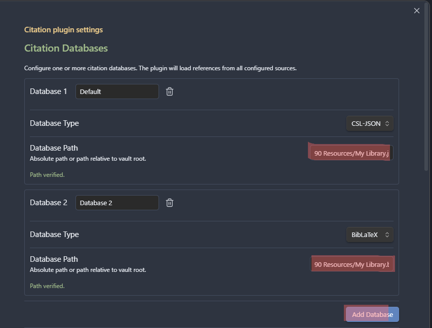
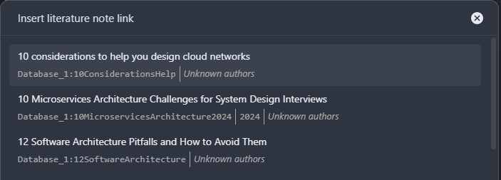

# Getting Started

## Installation

Install from Obsidian's Community Plugins browser:

1. Open **Settings** > **Community plugins** > **Browse**
2. Search for **Citation Extended**
3. Click **Install**, then **Enable**

## Configuring a Citation Database

The plugin reads bibliography data from files exported by your reference manager.

### Zotero (recommended)

1. Install [Better BibTeX](https://retorque.re/zotero-better-bibtex/) in Zotero
2. Select a collection in Zotero's left sidebar
3. **File** > **Export library...** > choose **Better BibLaTeX** or **Better CSL JSON**
4. Check **Keep updated** for automatic re-export
5. Save the file somewhere accessible from your vault

### Mendeley

1. Export your library as BibTeX (`.bib` file)
2. In plugin settings select **BibLaTeX** format

### Paperpile

1. Enable [automatic BibTeX sync](https://forum.paperpile.com/t/new-automatic-bibtex-sync-and-overleaf-integration-public-beta/5680/3)
2. Use Hazel or similar to copy the `.bib` file to your vault

### Adding the Database in Settings

1. Open plugin settings > **Citation databases**
2. Click **Add database**
3. Enter a friendly name, select the format, provide the file path
4. The status indicator will show "Path verified" when the file is found

## Creating Your First Literature Note

1. Press `Ctrl+Shift+O` (or use the command palette: **Open literature note**)
2. Search for a reference by title, author, or year
3. Select a reference — the plugin creates a note using your configured template
4. The note is saved in your configured literature note folder

