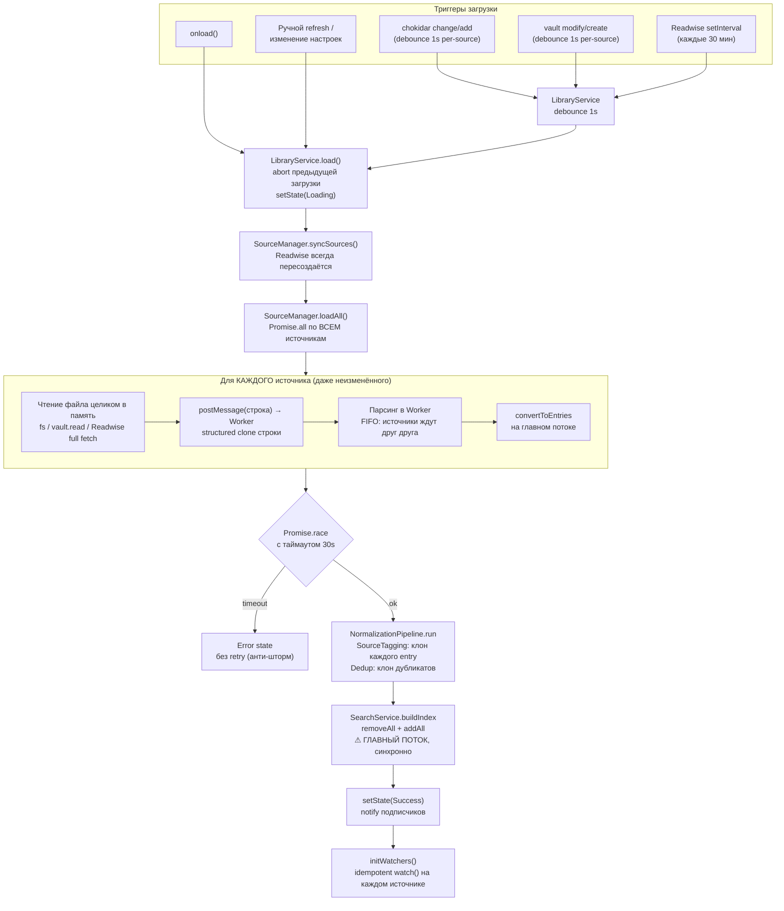
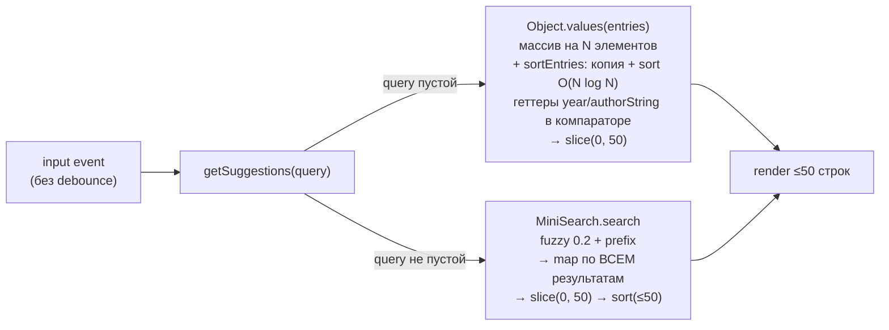
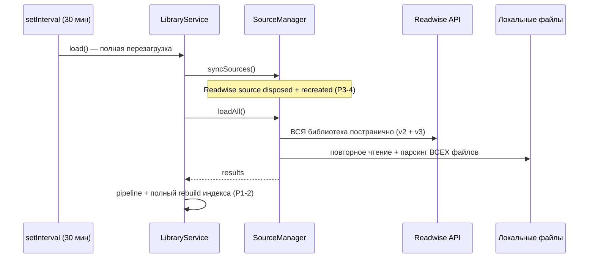
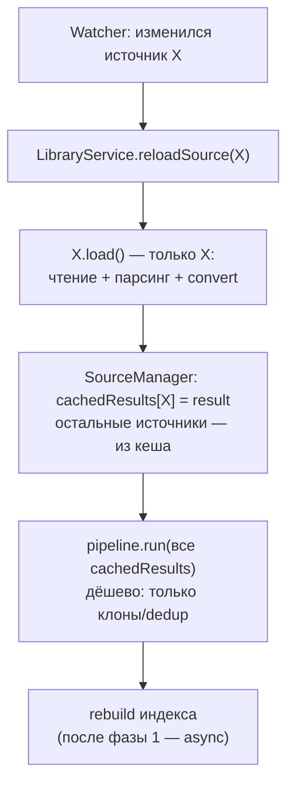

# Анализ производительности и стабильности подсистемы баз данных

> Дата анализа: 2026-06-10. Версия плагина: 0.6.0 (master, commit `4f22cb1`).
> Объект анализа: загрузка библиотек (BibTeX / CSL-JSON / Hayagriva / Readwise),
> нормализация, индексация, поиск, file watchers, организация кода и интерфейсов.

---

## 1. Резюме (TL;DR)

Архитектура подсистемы спроектирована грамотно: Clean Architecture выдержана,
парсинг вынесен в Web Worker, есть debounce, timeout, retry с backoff и
AbortController. **Главная проблема не в архитектуре, а в стратегии обновления
данных: система всегда делает полную работу, даже когда изменилась малая часть.**

Три системных решения порождают почти всю фоновую нагрузку:

1. **Любое изменение любого источника → полная перезагрузка ВСЕХ источников**
   (повторное чтение и парсинг всех файлов, полная нормализация, полное
   перестроение поискового индекса).
2. **Поисковый индекс строится синхронно на главном потоке** — единственное
   место, которое гарантированно замораживает UI на больших библиотеках.
3. **Readwise polling каждые 30 минут скачивает всю библиотеку Readwise целиком**
   (без `updatedAfter`) и при этом запускает п.1 — полную перезагрузку всего.

Сводная таблица узких мест (детали в разделе 4):

| #    | Узкое место                                                     | Где                                      | Влияние                                  | Сложность фикса |
| ---- | --------------------------------------------------------------- | ---------------------------------------- | ---------------------------------------- | --------------- |
| P1-1 | Полная перезагрузка всех источников при изменении одного        | `LibraryService.load` + `SourceManager`  | Постоянная фоновая нагрузка CPU/IO       | Средняя         |
| P1-2 | Построение индекса MiniSearch на главном потоке                 | `SearchService.buildIndex`               | Заморозка UI (0.3–3 c на 10k+ записей)   | Низкая          |
| P1-3 | Readwise: полный re-fetch без `updatedAfter` + каскадный reload | `ReadwiseSource` + polling               | Сеть + CPU каждые 30 минут               | Средняя         |
| P2-1 | Геттеры `year`/`authorString`/`issuedDate` в компараторах       | `sortEntries` + адаптеры                 | Сотни тысяч аллокаций Date на сортировку | Низкая          |
| P2-2 | Пустой запрос: `Object.values` + сортировка всей библиотеки     | `CitationSearchModal.getSuggestions`     | O(N log N) на каждое открытие модалки    | Низкая          |
| P2-3 | `search()` маппит весь результат до среза                       | `SearchService.search`                   | Лишний проход по всем результатам        | Тривиальная     |
| P2-4 | Один worker, FIFO: парсинг нескольких БД последовательный       | `WorkerManager`                          | Время загрузки = сумма парсингов         | Средняя         |
| P2-5 | Модалка «слепнет» во время фоновой перезагрузки                 | `CitationSearchModal.getSuggestions`     | UX: пустые результаты при reload         | Низкая          |
| P3-1 | Двойное клонирование каждого entry в pipeline                   | `SourceTaggingStep`, `DeduplicationStep` | 2N аллокаций на загрузку                 | Низкая          |
| P3-2 | Копия строки файла при `postMessage` в worker                   | `LocalFileSource` → `WorkerManager`      | 2–3× памяти от размера файла в пике      | Средняя         |
| P3-3 | Regex по полному `note` до усечения в `toSearchDocument`        | `Entry.toSearchDocument` / `note`        | Regex по мегабайтам highlights           | Тривиальная     |
| P3-4 | Readwise source пересоздаётся на каждом `syncSources`           | `SourceManager.syncSources`              | Сброс polling-таймера, лишние объекты    | Низкая          |

---

## 2. Как подсистема работает сейчас

### 2.1. Полный поток данных при загрузке



Ключевое следствие: **узлы `READ → POST → PARSE → CONV → PIPE → INDEX`
выполняются для всей библиотеки целиком при каждом срабатывании любого
триггера.** Better BibTeX auto-export трогает `.bib`-файл при каждом изменении
в Zotero — то есть это происходит часто.

### 2.2. Поток поиска (на каждое нажатие клавиши в модалке)



### 2.3. Что уже сделано хорошо (важно не сломать)

| Механизм                              | Где                                  | Оценка                                                             |
| ------------------------------------- | ------------------------------------ | ------------------------------------------------------------------ |
| Парсинг в Web Worker                  | `worker.ts`, `WorkerManager`         | Самая тяжёлая операция (BibTeX parse) уже не блокирует UI          |
| AbortController на загрузку           | `LibraryService.load`                | Новая загрузка корректно отменяет предыдущую                       |
| Timeout + запрет retry после timeout  | `LibraryLoadTimeoutError`            | Защита от «retry storm» — осознанная и задокументированная         |
| Retry с экспоненциальным backoff (5×) | `handleErrorRetry`                   | Переживает кратковременные блокировки файла при auto-export        |
| Каскадный debounce                    | chokidar 500ms + source 1s + lib 1s  | Серии событий записи схлопываются в одну перезагрузку              |
| Частичный отказ источников            | `SourceManager.loadAll`              | Один упавший источник не валит всю библиотеку                      |
| Стабильные ключи источников           | `makeKey` = `transport:type:id:path` | Переименование БД не пересоздаёт watcher                           |
| Иммутабельность шагов pipeline        | `NormalizationPipeline`              | Шаги не мутируют вход — предсказуемо и тестируемо                  |
| Offline-кеш Readwise per-database     | `readwise-cache-<id>.json`           | Выживает при недоступности API; корректно различает outage и cache |
| Усечение `notesText` до 5000 символов | `Entry.MAX_NOTES_INDEX_CHARS`        | Ограничивает рост индекса на больших Readwise-коллекциях           |

Организация кода и интерфейсов претензий не вызывает: слои изолированы,
`IPlatformAdapter` отрезает Obsidian API, `ISourceManager` / `DataSource` /
`NormalizationStep` — правильные точки расширения. Все проблемы ниже —
локальные и чинятся без перекройки архитектуры.

---

## 3. Исследование: где именно тратится время

Оценки для ориентира — «средняя» библиотека 10 000 записей (~20 МБ BibTeX) и
«большая» 50 000 записей. Точные числа должен дать бенчмарк из раздела 7.

```mermaid
gantt
    title Примерный таймлайн одной полной перезагрузки (10k записей, 2 БД)
    dateFormat X
    axisFormat %L ms

    section Главный поток
    Чтение файлов + decode           :a1, 0, 150
    convertToEntries (×2 БД)         :a3, 2150, 100
    Pipeline (2 клона на entry)      :a4, 2250, 80
    buildIndex MiniSearch  (UI FREEZE) :crit, a5, 2330, 1200
    section Worker (FIFO)
    Parse БД 1 (BibTeX)              :b1, 150, 1300
    Parse БД 2 (ждала в очереди)     :b2, 1450, 700
```



Вывод из таймлайна:

- Worker честно разгружает главный поток на парсинге, **но FIFO-очередь делает
  загрузку нескольких БД последовательной** — «параллельность» `loadAll()`
  упирается в один worker.
- Единственная крупная синхронная работа на главном потоке — `buildIndex`.
  Именно она даёт ощущение «плагин подтормаживает Obsidian» после каждого
  изменения файла библиотеки.

---

## 4. Узкие места — детально

### P1-1. Любое изменение → полная перезагрузка всех источников

`SourceManager.initWatchers` передаёт всем источникам один и тот же callback,
который вызывает `LibraryService.load()` — а тот всегда грузит всё:

```typescript
// src/library/library.service.ts:269-281
initWatcher(): void {
  this.sourceManager.initWatchers(() => this.triggerLoadWithDebounce());
}

private triggerLoadWithDebounce(): void {
  // ...
  this.loadDebounceTimer = window.setTimeout(() => {
    void this.load();   // <-- full reload of EVERY source
  }, LOAD_DEBOUNCE_MS);
}
```

При этом результат загрузки каждого источника (`SourceLoadResult`) нигде не
кешируется — он живёт только внутри одного вызова `load()`. Изменился
`zotero.bib` → заново читается и парсится также `mendeley.json`, заново
выкачивается Readwise (или читается его кеш), заново прогоняется pipeline и
индекс по всем записям.

**Последствия:** фоновая нагрузка пропорциональна размеру *всей* библиотеки, а
не размеру изменения. Это главный источник жалобы «плагин постоянно нагружает
систему».

**Решение** (фаза 2, раздел 6): хранить последний `SourceLoadResult` per-source
в `SourceManager`, в watcher-callback передавать идентификатор изменившегося
источника и перезагружать только его. Pipeline и индекс перестраиваются по
кешированным результатам остальных источников (это дёшево по сравнению с
чтением+парсингом).

### P1-2. Индексация MiniSearch на главном потоке

```typescript
// src/library/library.service.ts:230-231
console.debug('Citation plugin: Building search index');
this.searchService.buildIndex(Object.values(this.library.entries));

// src/search/search.service.ts:57-65
public buildIndex(entries: Entry[]): void {
  this.isIndexing = true;
  this.index.removeAll();
  const docs = entries.map((entry) => entry.toSearchDocument());
  this.index.addAll(docs);          // <-- synchronous, main thread
  this.isIndexing = false;
}
```

Индексируется до 5000 символов `notesText` на запись. Для 10k записей с
заметками это потенциально десятки мегабайт текста, токенизируемых синхронно.
Это происходит **после каждой перезагрузки**, т.е. в связке с P1-1 — при каждом
изменении файла и каждом Readwise poll.

**Решение (быстрое):** MiniSearch имеет штатный `addAllAsync(docs, { chunkSize })`,
который обрабатывает документы порциями, отдавая управление event loop, —
замена одной строки убирает заморозку UI (общее время чуть растёт, но кадры не
теряются). Поле `isIndexing` уже существует и готово отражать асинхронность.

**Решение (полное, фаза 4):** строить индекс в worker и передавать сериализацию
(`JSON.stringify(index)` в worker → `MiniSearch.loadJSONAsync` на главном
потоке). Это убирает токенизацию с главного потока полностью.

### P1-3. Readwise: полный re-fetch + каскадная полная перезагрузка

API-клиент *поддерживает* инкрементальную синхронизацию, но источник её не
использует:

```typescript
// src/core/readwise/readwise-api-client.ts:200-201 — параметр есть
async fetchExportBooks(options?: {
  updatedAfter?: string;   // <-- supported by the client

// src/sources/readwise-source.ts:526-529 — но не передаётся
const [booksResult, docsResult] = await Promise.allSettled([
  this.client.fetchExportBooks({ signal }),       // full export every time
  this.client.fetchReaderDocuments({ signal }),   // full list every time
]);
```

Плюс цепочка усиления: `watch()` Readwise — это `setInterval`, callback которого
запускает **полную** перезагрузку всех источников (P1-1):



**Решение:** хранить `lastSyncAt` per-source, передавать `updatedAfter`, мержить
дельту с офлайн-кешем (кеш уже полный и per-database — инфраструктура готова).
Отдельно: poll Readwise не должен триггерить перечитывание локальных файлов —
это решается тем же per-source reload из P1-1.

### P2-1. Геттеры в компараторах сортировки

Все адаптеры вычисляют `issuedDate` / `authorString` в геттерах при каждом
обращении, без мемоизации:

```typescript
// src/core/adapters/biblatex-adapter.ts:183-185
get issuedDate(): Date | null {
  return this.issued ? new Date(this.issued) : null;   // new Date per access
}

// src/core/types/entry.ts:103-107
public get year(): number | undefined {
  return this._year
    ? parseInt(this._year)
    : this.issuedDate?.getUTCFullYear();                // may allocate a Date
}
```

`sortEntries('year-desc')` дергает `a.year` и `b.year` в компараторе — это до
`2 × N × log₂N` вызовов. Для 10k записей ≈ 266 000 обращений, для записей без
`_year` каждое — парсинг строки даты и аллокация `Date`. `author-asc` ещё
дороже: `authorString` у BibLaTeX-адаптера каждый раз заново маппит и джойнит
массив авторов, а сравнение идёт через `localeCompare` без `Intl.Collator`.

**Решение:** либо мемоизировать геттеры в адаптерах (однократное вычисление в
конструкторе или ленивое поле), либо сортировать через предвычисленный ключ
(Schwartzian transform), либо — лучшее для модалки — см. P2-2.

### P2-2. Пустой запрос: вся библиотека на каждое открытие модалки

```typescript
// src/ui/modals/citation-search-modal.ts:149-152
if (!query) {
  const entries = Object.values(library.entries);          // array of N refs
  return sortEntries(entries, sortOrder).slice(0, this.limit);  // copy + O(N log N)
}
```

Это выполняется при каждом открытии модалки и каждом возврате поля ввода к
пустому состоянию. Сортировка стабильна между загрузками — пересортировывать
одно и то же бессмысленно.

**Решение:** кешировать отсортированный массив (или только top-50) в
`LibraryService`/`SearchService`, инвалидировать в `buildLibrary()`. Сортировка
делается один раз за загрузку, модалка получает срез за O(1).

### P2-3. `search()` маппит весь результат до среза

```typescript
// src/search/search.service.ts:67-72
public search(query: string): string[] {
  if (!query) return [];
  const results = this.index.search(query);   // ALL matches, scored + sorted
  return results.map((r) => r.id as string);  // map over ALL of them
}
```

Модалка использует только первые 50 (`ids.slice(0, this.limit)`), но `map`
проходит по всем. На широких префиксных запросах («a») совпадений тысячи.
Заодно: в `search()` стоит передавать лимит контрактом (`search(query, limit)`),
чтобы срез был внутри сервиса, а не обязанностью вызывающего.

### P2-4. Один worker, FIFO-очередь, отмена не прерывает парсинг

```typescript
// src/util.ts:44-47 — comment in the code admits it
// We can't truly "cancel" the worker thread operation once sent,
// but we can ignore the result if aborted.
const result = (await this.worker.postMessage(msg)) as TResult;
```

Следствия:

- Загрузка K баз данных = сумма времён парсинга, а не максимум.
- Залипший парсинг (огромный файл) блокирует очередь; timeout библиотеки
  истечёт, но worker продолжит жечь CPU, и следующая загрузка встанет за ним
  в очередь. Защита от retry-шторма это смягчает, но не устраняет.

**Решение:** worker-пул размером `min(числу БД, 2–3)` — каждый источник получает
свой worker, отмена реализуется через `worker.terminate()` + пересоздание
(дёшево, worker инлайнится бандлом). Это одновременно даёт настоящую
параллельность и настоящую отмену.

### P2-5. Модалка «слепнет» при фоновой перезагрузке

```typescript
// src/ui/modals/citation-search-modal.ts:142-145
const library = this.libraryService.library;
if (this.libraryService.isLibraryLoading || !library) {
  return [];   // <-- old library is still in memory, but we hide it
}
```

`LibraryService.library` во время перезагрузки не обнуляется — старые данные
валидны. Но модалка при статусе `Loading` показывает пустоту и блокирует ввод
(`setLoading(true)` → `inputEl.disabled = true`). В связке с P1-1/P1-3 это
значит: каждые 30 минут (Readwise poll) или при каждом авто-экспорте Zotero
открытая модалка на секунды превращается в «Loading...».

**Решение:** stale-while-revalidate — продолжать поиск по старой библиотеке,
пока идёт перезагрузка (индикатор обновления показывать ненавязчиво, не
блокируя ввод). Блокировать только первый запуск, когда `library === null`.

### P3-1. Двойное клонирование каждого entry в pipeline

```typescript
// src/infrastructure/normalization-pipeline.ts:91-99 (SourceTaggingStep)
return entries.map((entry) => {
  const tagged = Object.create(Object.getPrototypeOf(entry) as object) as Entry;
  Object.assign(tagged, entry, { _sourceDatabase: metadata.databaseName });
  return tagged;
});
```

`SourceTaggingStep` клонирует все N записей, `DeduplicationStep` — ещё раз
дубликаты. Иммутабельность — правильный принцип для шагов, но здесь вход
(`result.entries`) и так создан этим же `load()` и никому больше не принадлежит;
клон защищает от никого. На 50k записей это 50–100k лишних аллокаций +
`Object.assign` по ~30 полей.

**Решение:** ослабить контракт до «pipeline владеет входом» и мутировать
(одна строка `entry._sourceDatabase = ...`), либо объединить оба шага в один
проход с одним клоном. Приоритет низкий — чинить после P1-x, замерив на
бенчмарке.

### P3-2. Копия строки файла при передаче в worker

```typescript
// src/sources/local-file-source.ts:51-60
const buffer = await FileSystemAdapter.readLocalFile(resolvedPath); // ArrayBuffer
const value = new TextDecoder('utf8').decode(new DataView(buffer)); // string copy #1
const result = await this.loadWorker.post({
  databaseRaw: value,            // structured clone -> string copy #2
  databaseType: this.format,
}, signal);
```

Пиковое потребление ≈ 3× размера файла (buffer + строка + клон строки в worker).
Для 50 МБ `.bib` это ~150 МБ временно.

**Решение:** передавать `ArrayBuffer` как transferable
(`postMessage(msg, [buffer])` — zero-copy) и декодировать `TextDecoder`-ом уже
в worker. Потребует небольшого расширения протокола `WorkerRequest`
(`databaseRaw: string | ArrayBuffer`).

### P3-3. Regex по полному `note` до усечения

```typescript
// src/core/types/entry.ts:242
notesText: this.note.slice(0, Entry.MAX_NOTES_INDEX_CHARS),
```

Геттер `note` сначала прогоняет **весь** агрегированный текст highlights через
цепочку из ~12 regex-замен (`decodeHtmlEntities` + конвертация ссылок), и только
потом результат усекается до 5000 символов. Для Readwise-книги с сотнями
highlights это regex по мегабайтам ради 5 КБ.

**Решение:** усечь сырьё с запасом до декодирования
(`raw.slice(0, MAX * 2)` → regex → `slice(0, MAX)`), либо завести
`noteForIndex()` рядом с `note`.

### P3-4. Readwise source пересоздаётся на каждом `syncSources`

```typescript
// src/infrastructure/source-manager.ts:57-62
// API-based sources (Readwise) must be recreated on every sync
// because credentials live in db.path and may have changed.
if (this.sources.has(key) && this.isApiSource(transport)) {
  this.sources.get(key)!.source.dispose();
  this.sources.delete(key);
}
```

`syncSources` вызывается в начале **каждого** `load()` — значит, каждый reload
(в т.ч. от изменения локального файла) уничтожает Readwise source вместе с его
polling-таймером и создаёт заново. Таймер перезапускается с нуля — при частых
изменениях `.bib` периодический sync Readwise может никогда не наступить (или
наоборот: poll → reload → recreate → новый отсчёт). Поведение нестабильно по
времени.

**Решение:** включить хеш токена в ключ source (`transport:type:id:tokenHash`)
и пересоздавать только при реальной смене токена; либо дать source метод
`updateCredentials()`.

---

## 5. Память

| Что держим                              | Оценка для 10k записей                   | Комментарий                                                 |
| --------------------------------------- | ---------------------------------------- | ----------------------------------------------------------- |
| `Library.entries` (адаптеры + raw data) | ~50–150 МБ с большими highlights         | Адаптер хранит ссылку на полный raw-объект парсера          |
| Индекс MiniSearch                       | ~10–60 МБ (зависит от `notesText`)       | Усечение 5000 симв. уже ограничивает рост                   |
| Пик во время перезагрузки               | ~2× библиотеки + 3× размера файла (P3-2) | Старая библиотека жива, пока строится новая — это осознанно |
| Клоны pipeline (P3-1)                   | Кратковременно +1–2× массива записей     | Быстро собирается GC, но создаёт GC-паузы                   |

Отдельно: `Library.size` — это `Object.keys(entries).length`, O(N) на каждый
вызов. Вызывается редко (статус-бар), но при выносе в горячий путь станет
проблемой — лучше зафиксировать число при создании.

---

## 6. План стабилизации и ускорения

Принцип: сначала дешёвые точечные фиксы горячего пути (фаза 1), затем
структурное устранение «полной работы» (фазы 2–3), затем вынос индексации с
главного потока (фаза 4). Каждая фаза самодостаточна и мержится отдельно.

### Фаза 1 — быстрые победы (низкий риск, день работы)

| Фикс                                                      | Закрывает | Изменения                                           |
| --------------------------------------------------------- | --------- | --------------------------------------------------- |
| `addAll` → `addAllAsync({ chunkSize })` в `buildIndex`    | P1-2      | `SearchService` (+ `isReady` уже готов к async)     |
| Кеш отсортированного списка для пустого запроса           | P2-2      | `LibraryService.buildLibrary` + модалка             |
| `search(query, limit)` со срезом внутри сервиса           | P2-3      | `SearchService` + вызовы                            |
| Мемоизация `issuedDate`/`authorString`/`year` в адаптерах | P2-1      | 4 адаптера, ленивые поля                            |
| Усечение `note` до regex-декодирования                    | P3-3      | `Entry.toSearchDocument`                            |
| Stale-while-revalidate в модалке                          | P2-5      | `CitationSearchModal.getSuggestions` / `setLoading` |

### Фаза 2 — инкрементальная перезагрузка (главный структурный фикс)

Закрывает P1-1 и большую часть P1-3 (каскад). Суть:



Изменения:

- `SourceManager` хранит `Map<key, SourceLoadResult>` последних результатов.
- Callback watcher-а получает ключ источника: `initWatchers((sourceKey) => ...)`.
- `LibraryService.load()` остаётся как «полная» загрузка (первый запуск, ручной
  refresh, изменение настроек); добавляется `reloadSource(key)`.
- Pipeline и индекс по-прежнему перестраиваются целиком — это приемлемо,
  т.к. их стоимость на порядок ниже чтения+парсинга (а индекс после фазы 1
  не блокирует UI). Инкрементальный апдейт индекса (`discard`/`add` только
  изменённых записей) — возможная фаза 5, если бенчмарки покажут необходимость.

### Фаза 3 — инкрементальный Readwise sync

- Передавать `updatedAfter = lastSyncAt` в оба эндпоинта (клиент уже умеет).
- Мержить дельту с офлайн-кешем (кеш полный, per-database — готов к роли базы).
- Polling-таймер вызывает `reloadSource(readwiseKey)`, а не глобальный reload.
- Стабилизировать жизненный цикл source: пересоздание только при смене токена
  (P3-4).

### Фаза 4 — индексация и тяжёлая работа вне главного потока

- Построение индекса в worker, передача `MiniSearch.loadJSONAsync`-сериализации.
- Transferable `ArrayBuffer` вместо строки в worker (P3-2).
- Worker-пул на 2–3 воркера для параллельного парсинга и настоящей отмены
  через `terminate()` (P2-4).

---

## 7. Бенчмарки: что добавить

Существующий `tests/search/benchmark.spec.ts` измеряет только «голый» MiniSearch
на синтетических записях **без `notesText`** и без боевой конфигурации
(fuzzy + prefix + processTerm) — он не ловит ни одно из найденных узких мест.

Предлагаемый набор (новая папка `tests/benchmarks/`, запуск отдельной командой
`npm run bench`, чтобы не замедлять обычный CI):

| Бенчмарк                   | Что меряет                                              | Ловит |
| -------------------------- | ------------------------------------------------------- | ----- |
| `index-build.bench.ts`     | `SearchService.buildIndex` с notesText 0/1k/5k символов | P1-2  |
| `search-hot-path.bench.ts` | `search()` с боевыми опциями, широкие/узкие запросы     | P2-3  |
| `sort-entries.bench.ts`    | `sortEntries` поверх реальных адаптеров (не моков!)     | P2-1  |
| `pipeline.bench.ts`        | `NormalizationPipeline.run`, 2–3 источника, дубликаты   | P3-1  |
| `parse-biblatex.bench.ts`  | `loadEntries` на сгенерированном `.bib` 1/10/50 МБ      | P2-4  |
| `full-reload.bench.ts`     | Полный цикл load → pipeline → index (integration)       | P1-1  |

Критично для честности замеров: использовать **реальные адаптеры**
(`EntryBibLaTeXAdapter` поверх сгенерированного выхода парсера), а не моки с
полями-значениями — текущий бенчмарк маскирует стоимость геттеров (P2-1).

Скелет бенчмарка сортировки:

```typescript
// tests/benchmarks/sort-entries.bench.ts
import * as BibTeXParser from '@retorquere/bibtex-parser';
import { EntryBibLaTeXAdapter } from '../../src/core';
import { sortEntries } from '../../src/ui/modals/sort-entries';

function generateBib(count: number): string {
  // Generate realistic entries: date strings (forces Date parsing in the
  // `year` getter) and 3-6 authors (forces map+join in `authorString`).
  return Array.from({ length: count }, (_, i) =>
    `@article{key${i},
      title = {Title ${i}},
      author = {Smith, John and Doe, Jane and Brown, Bob},
      date = {20${String(i % 25).padStart(2, '0')}-03-15},
    }`,
  ).join('\n');
}

describe('sortEntries benchmark (real adapters)', () => {
  const entries = BibTeXParser.parse(generateBib(10_000)).entries.map(
    (e) => new EntryBibLaTeXAdapter(e),
  );

  test.each(['year-desc', 'author-asc'] as const)('%s', (order) => {
    const start = performance.now();
    sortEntries(entries, order);
    const elapsed = performance.now() - start;
    console.debug(`[10k] sortEntries(${order}): ${elapsed.toFixed(1)}ms`);
    expect(elapsed).toBeLessThan(100); // target after memoization fix
  });
});
```

Дополнительно — лёгкая телеметрия в коде (не бенчмарк, а наблюдаемость в бою):
обернуть этапы `load()` в `performance.mark`/`performance.measure` и выводить
сводку одной `console.debug`-строкой. Это позволит видеть реальные тайминги у
пользователей с большими библиотеками без воспроизведения.

---

## 8. Целевые метрики

| Метрика                                               | Сейчас (оценка)                  | Цель                        |
| ----------------------------------------------------- | -------------------------------- | --------------------------- |
| Блокировка главного потока за одну перезагрузку (10k) | 0.5–3 c (buildIndex и пр.)       | < 50 мс суммарно            |
| Реакция на изменение 1 файла из K баз                 | Полная работа по K базам         | Работа только по 1 базе     |
| `getSuggestions` на пустом запросе (10k, сортировка)  | 50–300 мс на каждый ввод         | < 5 мс (кешированный срез)  |
| `search()` на широком префиксе (10k)                  | 10–100 мс + map всех             | < 50 мс, срез внутри        |
| Readwise poll (большая библиотека)                    | Полный экспорт каждые 30 мин     | Дельта через `updatedAfter` |
| Поведение модалки при фоновом reload                  | Пустой список, ввод заблокирован | Поиск по старым данным      |

Все «Сейчас» — расчётные оценки по коду; первым шагом любой фазы должен идти
бенчмарк из раздела 7, фиксирующий фактическую базовую линию.
